=================================================
Genomics Data Warehouse documentation
=================================================

GDW at a glance
==========================
Genomics Data Warehouse (GDW) is built on top of Django, a Python web framework, and Elasticsearch, a distributed
RESTful search and analytics engine. To use GDW, you need to install Elasticsearch and the GDW Django app.

Installing Elasticsearch
==========================
We assume that GDW will be installed in a Eucalyptus-based cloud environment. The first step is to create a new security group in Eucalyptus. This security group will be used to isolate Elasticsearch nodes from the outside world. Elasticsearch by default does not have any security enabled. This allows anyone who can access port 9200 on the machine that Elasticsearch is installed on to make queries and even make changes to the Elasticsearch index. The company behind Elasticsearch provides a security package to manage security, but it is proprietary. The simplest way to secure Elasticsearch nodes is to use the Eucalyptus security groups to block all connections to the Elasticsearch nodes and selectively allow connections from trusted machines. As will be discussed later, the trusted machines should be in a separate security group from the Elasticsearch security group. Such a setup avoids accidentally opening up the Elasticsearch nodes to the outside world.

Go to https://console.ccr-cbls-2.ccr.buffalo.edu/securitygroups to create a new security group. In the new security group, open ports 22 and 9200 to your local machine. Port 22 is used for SSH access to nodes in the new security group. Port 9200 is used to communicate with the Elasticsearch nodes. Note that the nodes communicate with each other using port 9300, but nodes within a security group are treated as trusted, so all connections are allowed.

For the purposes of this documentation, an Elasticsearch cluster will be setup with three nodes, i.e., there will be three instances of Elasticsearch running. Elasticsearch has light CPU requirements. The ideal machine should have maximum of 64 GB. More memory does not help because of JVM limitations. Small amount of memory, less than 8 GB, will just lead to too much swapping, which is counterproductive.

In Eucalyptus, launch three new instances with Ubuntu 16.04 EBS. For instance type, choose ``m2.4xlarge: 4 CPUS, 49152 memory (MB)``. You can change the following cloud-init script to automate SSH login for your user.  Update ``name`` to your username, ``gecos`` to your full name, and ``ssh-authorized-keys`` to your SSH key::

    #cloud-config

    # log all output
    output: {all: '| tee -a /var/log/cloud-init-output.log'}

    users:
      - name: mkzia
        groups: adm
        gecos: Mohammad Zia
        shell: /bin/bash
        sudo: ALL=(ALL) NOPASSWD:ALL
        ssh-authorized-keys:
            - ssh-rsa ASDFSDF mkzia@Mohammads-iMac.local

    # upgrade all packages on initial boot
    package_upgrade: true

    runcmd:
      - timedatectl set-timezone America/New_York
      - updatedb

Under the ``USER DATA`` section select ``Enter text`` radio button and copy and paste the modified cloud-init script.
For storage volume size, specify 100 GB, which is more than enough for testing purposes. Change it if you think you will require more storage. Each GDW Elasticsearch nodes, for example, have 700 GB storage attached to them.

Next we will install Elasticsearch on each instance. Begin by doing system updates::

    sudo apt-get update
    sudo apt-get -y upgrade
    sudo apt autoremove

Add repository for installing latest Oracle JAVA::

    sudo add-apt-repository -y ppa:webupd8team/java
    sudo apt-get update

If aforementioned command does not work, you might have to open ports 80 and 443.
This was not necessary with instance image ``ubuntu1604-ebs-ccr-20170222-2``.

Install JAVA::

    sudo apt-get -y install oracle-java8-installer

Install Elasticsearch::

    wget -qO - https://packages.elastic.co/GPG-KEY-elasticsearch | sudo apt-key add -
    wget https://artifacts.elastic.co/downloads/elasticsearch/elasticsearch-5.1.1.deb
    sudo dpkg -i elasticsearch-5.1.1.deb

Elasticsearch V5.1.1 might not be the latest version available, but it is the latest version tested with GDW.

Next we will modify Elasticsearch options and update system-wide configurations to suit Elasticsearch.
This is best done by first becoming root::

    sudo su -

Open the file ``/etc/elasticsearch/jvm.options`` and update the amount of memory Elasticsearch can allocate when it starts up. The
amount of memory is set to half the system memory. Our instances were configured with 49156 MB of memory, so half of that
is around 24 GB. You will have to update two lines to allow JVM to allocate 24 GB. WARNING: Never allocate more than 32 GB.
Change lines::

    -Xms2g
    -Xmx2g

to::

    -Xms24g
    -Xmx24g

and save and close file.

Next open file ``/etc/elasticsearch/elasticsearch.yml`` and uncomment and update the following lines::

    # Uncomment line and update cluster name
    cluster.name: GDW-Test-Cluster

    # Uncomment line and update node name
    node.name: gdw-test-node-1

    # Uncomment line to enable JVM memory allocation when Elasticsearch starts
    bootstrap.memory_lock: true

    # Uncomment line and update host IP address
    network.host: 172.17.XX.XXX ### use cloud private and not public address

    # Uncomment line and add private IP addresses of other nodes in cluster.
    discovery.zen.ping.unicast.hosts: ["172.17.XX.XXX", "172.17.XX.XXX"]

    # You can update data location if you want. Default is /var/lib/elasticsearch -- which you can leave as is for now
    #path.data: /media/different_media

and save and close file. The ``cluster.name`` determines the cluster name. Nodes that share the same ``cluster.name`` are part
of an Elasticsearch cluster. Therefore, it is possible to create multiple clusters within a single Eucalyptus security group.

Next open ``/etc/security/limits.conf``, add limits for Elasticsearch at the end of file ::

    # At the end of file add lines:
    elasticsearch  -  nofile  65536
    elasticsearch soft memlock unlimited
    elasticsearch hard memlock unlimited

save and close file. These limits allow Elasticsearch to open large number of files at once and allows it to allocate unlimited amount of page/memory.

Next open ``/usr/lib/systemd/system/elasticsearch.service``, uncomment the following line, ::

    # Uncomment line to allow elasticsearch to allocate memory at startup
    LimitMEMLOCK=infinity

save, and close.

Next open ``/etc/default/elasticsearch``, uncomment the following lines,::

    # Uncomment line to allow elasticsearch to open large amounts of files
    MAX_OPEN_FILES=65536

    # Uncomment line to allow elasticsearch to allocate memory at startup
    MAX_LOCKED_MEMORY=unlimited

save, and close.

Next we need to install the Elasticsearch free license. The license is valid for one year. To install the license,
you have to first install ``X-Pack``, a plug-in for Elasticsearch that manages license and security. We will, however, disable
the security feature because it is proprietary. To install ``X-Pack`` execute::

    /usr/share/elasticsearch/bin/elasticsearch-plugin install x-pack

Open ``/etc/elasticsearch/elasticsearch.yml`` and disable X-pack security by adding the following line at the end of the file ::

    xpack.security.enabled: false

save and close.

Next enable Elasticsearch and configure it to start at boot by executing the following lines::

    systemctl daemon-reload
    systemctl enable elasticsearch.service
    systemctl start elasticsearch.service

Test the Elasticsearch installation by going to its public IP address on port 9200::
    http://199.109.XXX.XXX:9200/

To get the free/basic Elasicsearch license, register https://register.elastic.co/. You should receive an email pointing
to a website from which you can downloading the license as a JSON file. So install the license, you have to send the license
to your instance of Elasticsearch twice. Change to the directory on your local machine where the JSON license file is saved.
Send the license file using CURL from your local machine as follows::

    curl -XPUT 'http://199.109.XXX.XXX:9200/_xpack/license' -d @mohammad-zia-ff462980-7da1-44ce-99f4-26e2952e43fc-v5.json

where you should update the IP address to match your Elasticsearch instance and after the `@` should be the name of your license file. You should receive a message as follows::

    {"acknowledged":false,"license_status":"valid","acknowledge":{"message":"This license update requires acknowledgement. To acknowledge the license, please read the following messages and update the license again, this time with the \"acknowledge=true\" parameter:","watcher":["Watcher will be disabled"],"security":["The following X-Pack security functionality will be disabled: authentication, authorization, ip filtering, and auditing. Please restart your node after applying the license.","Field and document level access control will be disabled.","Custom realms will be ignored."],"monitoring":["Multi-cluster support is disabled for clusters with [BASIC] license. If you are\nrunning multiple clusters, users won't be able to access the clusters with\n[BASIC] licenses from within a single X-Pack Kibana instance. You will have to deploy a\nseparate and dedicated X-pack Kibana instance for each [BASIC] cluster you wish to monitor.","Automatic index cleanup is locked to 7 days for clusters with [BASIC] license."],"graph":["Graph will be disabled"]}}

Send the license again, but this time with acknowledgment::

    curl -XPUT 'http://199.109.XXX.XXX:9200/_xpack/license?acknowledge=true' -d @mohammad-zia-ff462980-7da1-44ce-99f4-26e2952e43fc-v5.json

Check that the license was installed by going to http://199.109.XXX.XXX:9200/_xpack/license. You should see something like::

    {
      "license" : {
        "status" : "active",
        "uid" : "ff462980-7da1-44ce-99f4-26e2952e43fc",
        "type" : "basic",
        "issue_date" : "2017-02-27T00:00:00.000Z",
        "issue_date_in_millis" : 1488153600000,
        "expiry_date" : "2018-02-27T23:59:59.999Z",
        "expiry_date_in_millis" : 1519775999999,
        "max_nodes" : 100,
        "issued_to" : "Mohammad Zia (University at Buffalo)",
        "issuer" : "Web Form",
        "start_date_in_millis" : 1488153600000
      }
    }

You should reboot the system to make sure that Elasticsearch is enabled at boot time. Up to this point you should have one instance of Elasticsearch running. You should now repeat all steps on the other two nodes in the cluster except for installing the license. The license only needs to be installed on one node of the cluster. Finally check the status of the
cluster by going to::

    http://199.109.XXX.XXX:9200/_cluster/health?pretty=true

you should see ``"number_of_data_nodes" : 3`` ::

    {
      "cluster_name" : "GDW-Test-Cluster",
      "status" : "green",
      "timed_out" : false,
      "number_of_nodes" : 3,
      "number_of_data_nodes" : 3,
      "active_primary_shards" : 3,
      "active_shards" : 6,
      "relocating_shards" : 1,
      "initializing_shards" : 0,
      "unassigned_shards" : 0,
      "delayed_unassigned_shards" : 0,
      "number_of_pending_tasks" : 0,
      "number_of_in_flight_fetch" : 0,
      "task_max_waiting_in_queue_millis" : 0,
      "active_shards_percent_as_number" : 100.0
    }

This completes the installation of Elasticsearch.

.. raw:: latex

    \newpage

Installation checklist for Elasticsearch
=================================================
- [ ] Create a new security group in Eucalyptus
- [ ] Open ports 22 and 9200 to your local machine in the new security group
- [ ] Launch three instances with new security group
    - [ ] Select Ubuntu 16.04 EBS for image type
    - [ ] Choose ``m2.4xlarge: 4 CPUs, 49152 memory (MB)`` for instance type
    - [ ] Use updated cloud-init script to automate SSH login for your user
    - [ ] Specify storage volume
- [ ] Install Elasticsearch on each instance
    - [ ] Log in
    - [ ] Do system update
    - [ ] Add JAVA repository and update apt-get
    - [ ] Download and install Elasticsearch
- [ ] Configure Elasticsearch
    - [ ] Become root ``sudo su -``
    - [ ] Edit ``/etc/elasticsearch/jvm.options``
    - [ ] Edit ``/etc/elasticsearch/elasticsearch.yml``
    - [ ] Edit ``etc/security/limits.conf``
    - [ ] Edit ``/usr/lib/systemd/system/elasticsearch.service``
    - [ ] Edit ``/etc/default/elasticsearch``
    - [ ] Install ``X-pack``
    - [ ] Disable ``X-pack`` security in ``/etc/elasticsearch/elasticsearch.yml``
    - [ ] Enable Elasticsearch at boot
    - [ ] Register for license
    - [ ] Install license * only install on one instance of the cluster

.. raw:: latex

    \newpage

Installing GDW App
==========================
Begin by creating a new security group in Eucalyptus. Open ports 22 and 8000 to your local machine. Port 22 will be used
to access your new instance and port 8000 will run the development instance of the GDW App. Launch one instance of image
type Ubuntu 16.04 EBS, instance type ``c1.medium: 4 CPUs, 16384 memory (MB)``, and storage volume of at least 40 GB.
You can use the following cloud-init script to automate SSH login for your user ::

    #cloud-config

    # log all output
    output: {all: '| tee -a /var/log/cloud-init-output.log'}

    users:
      - name: mkzia
        groups: adm
        gecos: Mohammad Zia
        shell: /bin/bash
        sudo: ALL=(ALL) NOPASSWD:ALL
        ssh-authorized-keys:
            - ssh-rsa ASDFSDF mkzia@Mohammads-iMac.local

    # upgrade all packages on initial boot
    package_upgrade: true

    runcmd:
      - timedatectl set-timezone America/New_York
      - updatedb

Next allows access to port 9200 in the Elasticsearch security group that you created previously to your new instance.
You need to use the Public IP address. The GDW App is built on top of Django. Django requires Python. The best way to
install Django is to first install Anaconda Python, create a virtualenv in Anaconda Python, and finally install all the
required packages in the virtualenv using ``pip``. Download Anaconda Python ::

    wget https://repo.continuum.io/archive/Anaconda3-4.3.0-Linux-x86_64.sh

Make the downloaded file executable using ``chmod`` ::

    chmod +x https://repo.continuum.io/archive/Anaconda3-4.3.0-Linux-x86_64.sh

Run the script to install Anaconda ::

    ./Anaconda3-4.3.0-Linux-x86_64.sh

and make sure agree to prepend the Anaconda3 install location. Log out and log back in so that Anaconda Python is your default
Python. You check check this by executing ``which python``. Create a new Python virtualenv ::

    conda create -n gdw python=3 pip

Activate the new virtualenv::

    source activate gdw

Download the gdw_2017_02_28.zip from http://gdwdev.ccr.buffalo.edu:8001/ and `scp` it to your new instance, unzip it, and CD in to
the directory. Installed the required packages::

     pip install -r requirements.txt

Create the database tables associated with the app and some default values by executing ::

    python manage.py makemigrations msea news pybamview search
    python manage.py migrate
    python manage.py import_es_settings

Create a superuser who can log in to the admin site::

    python manage.py createsuperuser

Open gdw/settings.py and add the Public IP address in the allowed hosts lists::

    ALLOWED_HOSTS = ['199.109.194.239', 'gdwdev.ccr.buffalo.edu', 'gdw.ccr.buffalo.edu', 'PUT PUBLIC IP HERE']

save and close file.

Start the development server using the private IP address::

    python manage.py runserver 172.17.XX.XXX:8000

Navigate the public IP address port 8000 of your instance and the GDW website should be running. Most of the functionality
will be broken because there is no connection with the Elasticsearc database. You can stop the development server using
``CTRL + c``.

.. raw:: latex

    \newpage

Installation checklist for GDW App
=================================================
- [ ] Create a new security group in Eucalyptus
- [ ] Open ports 22 and 8000 to your local machine in the new security group
- [ ] Launch one instance with new security group
    - [ ] Select Ubuntu 16.04 EBS for image type
    - [ ] Choose ``c1.medium: 4 CPUs, 16384 memory (MB)`` for instance type
    - [ ] Use updated cloud-init script to automate SSH login for your user
    - [ ] Specify storage volume, at least 40 GB
- [ ] Open port 9200 in the Elasticsearch security group for the Public IP address of your new instance
- [ ] Install Anaconda
- [ ] Create new Python virtualenv and activate it
- [ ] Download GDW App zip file and unzip
- [ ] Install the requirements via ``pip``
- [ ] Create database tables and import default settings
- [ ] Create superuser
- [ ] Start Dev Instance

.. raw:: latex

    \newpage

Getting familiar with Elasticsearch
=================================================
Now we will import sample data in to Elasticsearch in order to get familiar with it. Copy three files to your local machine:
``create_index.py``, ``insert_index.py``, and ``new_data.json`` to your local machine.
Open the file ``doc/elastic_demo/new_data.json``. The file contains seven records that will be imported in to Elasticsearch. A sample JSON record is as follows::

    {
        "index": 0,
        "isActive": false,
        "balance": 3696.70,
        "age": 33,
        "eyeColor": "blue",
        "first": "Jeri",
        "last": "Strickland",
        "tag": [
          "aliquip",
          "reprehenderit",
          "cupidatat",
          "occaecat",
          "nostrud"
        ],
        "friend": [
          {
            "friend_id": 0,
            "friend_name": "Greta Henry"
          },
          {
            "friend_id": 1,
            "friend_name": "Macdonald Daniels"
          },
          {
            "friend_id": 2,
            "friend_name": "Blake Kemp"
          }
        ],
        "favoriteFruit": "strawberry"
    }

There are nine fields in each JSON. The ``friend`` field is a nested field. Elasticsearch is NOSQL database that stores
JSON documents. Before inserting new documents in to Elasticsearch, you have to define the ''mappings'' of the data. Mappings
are a description of the data that indicates how Elasticsearch should store them and query them. For example, if something
is stored as a float, then Elasticsearch knows that range operators are allowed on a float. You can define mappings in Elasticsearch
directly using CURL or using the Python API. We will use the Python API to define the data mapping and import data in to Elasticsearch.
Make sure that your Python environment on your local machine, not the cloud instance, has the Elasticsearch package installed::

    pip install elasticsearch

The following is a possible mapping for the JSON discussed previously::

    'properties': {
        'index':            {'type' : 'integer'},
        'isActive':         {'type' : 'keyword'},
        'balance':          {'type' : 'float'},
        'age':              {'type' : 'integer'},
        'eyeColor':         {'type' : 'keyword'},
        'first':            {'type' : 'keyword'},
        'last':             {'type' : 'keyword'},
        'tag':              {'type' : 'text'},
        'friend' : {
            'type' : 'nested',
            'properties' : {
                'friend_id':    {'type' : 'integer'},
                'friend_name':  {'type' : 'text'},
            }
        },
        'favoriteFruit':    {'type' : 'keyword'}
    }

The ``index`` and ``age`` fields are defined as integer. Likewise for the nested ``friend_id`` field. It is not a requirement of Elasticsearch that the name of nested fields begin with ``friend``, but it is a requirement of the GDW App. The ``balance`` field
is defined as a float. The fields ``isActive``, ``eyeColor``, ``first``, ``last``, and ``favoriteFruit`` as define as keyword.
Keyword mappings indicate to Elasticsearch that exact match is required, meaning it is case sensitive and spaces are significant.
The fields ``tag`` and ``friend_name``, however, are defined as text. This is the default analyzer for Elasticsearch. Text types
are are converted to lower case, split on spaces and punctuations are removed. So for example, `John Doe` will become `john` and `doe`, so searching on ``john`` or ``doe`` will give a hit, but not ``John`` or ``DOE``.

We will now put the mapping in Elasticsearch using ``create_index.py``. Open the file for editing. Update the IP Address
to an Elasticsearch node ::

    # Update the IP address
    es = elasticsearch.Elasticsearch(host="199.109.XXX.XX")

Now we will walk through the Python script and explain it.

``es = elasticsearch.Elasticsearch(host="199.109.XXX.XX")`` establishes connection to your Elasticsearch cluster.

``INDEX_NAME = 'demo_mon'`` specifies the ``INDEX_NAME``. Index name in Elasticsearch is loosely equivalent to database name
in MySQL.

``type_name = 'demo_mon'`` specifies the ``type_name``. Type name in Elasticsearch is loosely equivalent to a table name, but
in Elasticsearch it is a name of a type of document that will be stored in an index. The following conditional deletes
the Index if it already exists. The following lines define the mapping previously discussed. ::

    mapping = {
        type_name: {
            'properties': {
                'index':            {'type' : 'integer'},
                'isActive':         {'type' : 'keyword'},
                'balance':          {'type' : 'float'},
                'age':              {'type' : 'integer'},
                'eyeColor':         {'type' : 'keyword'},
                'first':            {'type' : 'keyword'},
                'last':             {'type' : 'keyword'},
                'tag':              {'type' : 'text'},
                'friend' : {
                    'type' : 'nested',
                    'properties' : {
                        'friend_id':    {'type' : 'integer'},
                        'friend_name':  {'type' : 'text'},
                    }
                },
                'favoriteFruit':    {'type' : 'keyword'}
            }
        }
    }

``es.indices.put_mapping(index=INDEX_NAME, doc_type=type_name, body=mapping)`` puts the mapping in Elasticsearch. Run the script
after updating the IP address to put the mapping in Elasticsearch. You can verify that the mapping has been put in Elasticsearch by going to http://199.109.XXX.XXX:9200/demo_mon?pretty=true

Next open the file ``insert_index.py`` and update the IP address. The is simple to understand. It reads the data contained
in ``new_data.json`` and inserts it in to Elasticsearch. Run the script after updating the IP address. You can verify
that the data has been imported by going to http://199.109.XXX.XXX:9200/demo_mon/_search?pretty=true. Now we will make some
queries using Elasticsearch.

Lets find all the active users. Paste the following in your shell::

    curl -XGET 'http://199.109.193.196:9200/demo_mon/demo_mon/_search?pretty=true' -d '
    {
        "query": {
            "bool": {
                "filter": [{"term": {"isActive": "true"}}]}},
        "size": 1000
    }
    '

Lets find all users whose age is greater than or equal to 22. Paste the following in your shell::

    curl -XGET 'http://199.109.193.196:9200/demo_mon/demo_mon/_search?pretty=true' -d '
    {
        "query": {
            "range" : {
                "age" : {
                    "gte" : 22
                }
            }
        }
    }
    '

Lets find Friend name `tanner`. Paste the following in your shell::

    curl -XGET 'http://199.109.193.196:9200/demo_mon/demo_mon/_search?pretty=true' -d '
    {
        "query": {
            "nested" : {
                "path" : "friend",
                "query" : {
                    "bool" : {
                        "filter" : { "term" : {"friend.friend_name" : "tanner"} }
                    }
                }
            }
        }
    }
    '

Notice that the whole document is returned along with the other the nested friends. This is how Elasticsearch works. GDW
filters the irrelevant nested term -- somewhat broken right now. As you can see, the search query string can become
unwieldy. Next we will learn how to create a GUI in GDW  to make queries with Elasticsearch convenient.

Building the GDW Web User Interface
============================================
Basically GDW provides a web-based user interface (UI) to make Elasticsearch queries. There are two ways to build the UI.
First, by logging in to the GDW admin site and building the UI by clicking through it. This is quite flexible,
but can become very tedious. Second, by programmatically building the UI by reading a JSON file that defines the
fields of the UI. Both ways will be described to make you familiar with how GDW works. Both ways are complementary
because in practice the UI is initially built programmatically and then modified and tweaked using the GDW admin
site. We begin by showing you how to build the UI using the GDW admin site.

Before you can begin building the UI, you need to become familiar with how its components are organized.

.. _component_1:
.. figure:: images/component_1.png
   :scale: 75 %
   :alt: UI components 1

   Figure shows the components that make up the web-based user interface (UI) of GDW. Filter fields, example `Variant Name`,
   are put inside panels, example `Variant Related Information`. Panels are put inside a tab, example `Simple`.
   Tabs are associated with a dataset. Datasets are associated with a study.

Figure :numref:`component_1` shows the components of the UI. Fields used for filtering are put inside a panel. Panels are used to
logically group filter fields. Panels can also also contain sub-panels that in turn can contain filter fields.
Sub-panels allows further grouping of filter fields within a panel. Figure :numref:`component_2` shows an example of a
sub-panel. Panels themselves are put inside a tab. Tabs can be used to separate panels in to different groups such
as `basic` and `advanced` search fields.

.. _component_2:
.. figure:: images/component_2.png
   :scale: 75 %
   :alt: UI components 2

   Figure shows an example of how sub-panels can be used to further organize filter fields with a panel.

GDW allows user to select which fields they want to display in the search results. This allows user to include more,
less, or different fields in the search results than the ones used for searching. The result fields are called
`attributes`--we are selecting the attributes of the filtered data that we want to see. Attribute fields are organized in a
similar manner to filter fields. Attribute fields are placed inside panels to logically group them. Panels can contain
sub-panels. Panels are placed inside tabs. Both the filter and attribute tabs are associated with
a dataset. Datasets are associated with a study. Finally, study can contain multiple datasets.

Adding study, dataset, and search options
--------------------------------------------
To begin building the UI log in to the admin site by going to http://199.109.XXX.XXX:8000/admin. Make sure that
the development server is running. Use the username and password that you used to create the `superuser`. First we will
add a new study by clicking the ``+ Add`` button next to `Studys`, see Figure :numref:`add_study`. In the `Add Study`
page, see Figure :numref:`add_study_page`, specify a name for the study. You can also add a description, but this is
optional, as indicated by the non-bold text label. Hit the save button to create the study. Click on the `home` link in
the breadcrumb navigation to return to the admin home page.

.. _add_study:
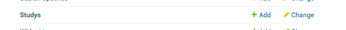

   Figure shows the ``+ Add`` button that is used to add a new study.

.. _add_study_page:
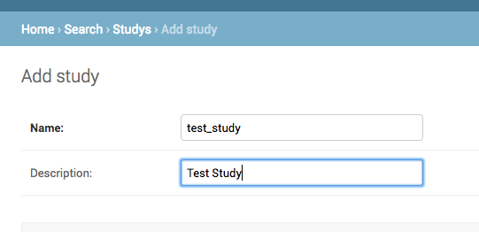

   Figure shows the Add study page. This page is used to add and update a study.

Next we will add a dataset that is associated with the study that we just added. Click ``+ Add`` button next to
`Datasets`. Select the study that you just added from the drop down menu. Fill in the dataset name
and description field. Next fill in the `Es index name`, `Es type name`, `Es host`, and `Es port`, which should be
`demo_mon`, `demo_mon`, the public IP address to an Elasticsearch node instance, and 9200, respectively. Check the
`is_public` field to make the demo dataset accessible by all. The allowed groups field allows you to manage which
groups can access the dataset if you want to restrict access to the dataset. User permissions will be described
in detail later. Figure :numref:`add_dataset_page` shows the add dataset page with the fields filled.
Click on the `home` link in the breadcrumb navigation to return to the admin home page.

.. _add_dataset_page:
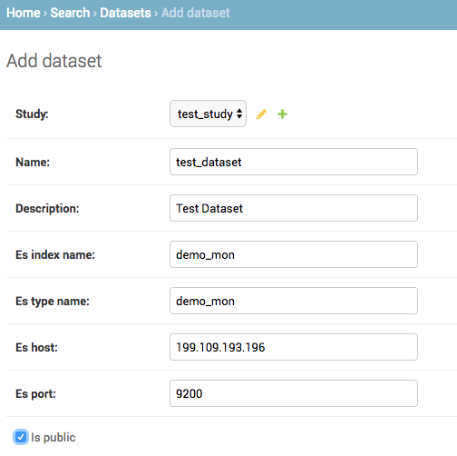

   Figure shows the add dataset page. This page is used to add and update a dataset.

Next we need to add search options for the dataset. A dataset can contain millions of documents. Displaying so
many results can cause rendering issues, so we use search options to limit the number of results that are shown to
400 documents. If you want to to fetch all the results, you can download them from the search results page.
To add the default search options,
click the ``+ Add`` button next to `Search options`. Choose the dataset you just added and leave the other values
to the default. Figure :numref:`add_search_options_page` shows the page for adding searching options for a dataset.

.. _add_search_options_page:
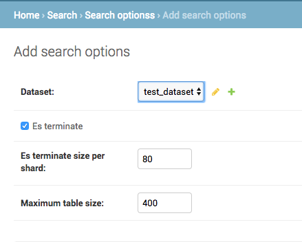

   Figure shows the Add search options page. This page is used to add and update the search options associated with a
   dataset. Search options limit the number of results returned matching the search criteria.

Adding filter fields
---------------------------
Now we are ready to add filter fields. Currently GDW supports three types of forms for filter fields: `CharField`,
`ChoiceField` and `MultipleChoiceField`. The `CharField` can use three types of form widget: `TextInput`, `TextArea`,
and `UploadField`. The `TextInput` widget is a simple text input box that allows the user to search for a single term.
The `TextArea` is also a text input box but allows rows of terms. Finally, the `UploadField` is uses the `TextArea` widget but with an extra upload button that allows the user to select a file from which to populate the `TextArea` widget.
The `TextArea` and `UploadField` widgets allow the user to search for multiple terms. The `ChoiceField` uses the `Select` widget
that renders a single-select drop down menu for selecting a single term to search for from a list of
choices. And the `MultipleChoiceField` field uses a `SelectMultiple` widget that renders a multi-select field to allow
the user to select multiple terms to search for from a list of choices.

Click ``+ Add`` button next to the ``Filter Fields``. Select `test_dataset` for Dataset, fill in `Display name`,
`Form type`, `Widget type`, `Es name`, `Es data type`, and `Es filter type` with `First Name, `CharField`, `TextArea`, `first`,
`keyword`, and
`filter_term`, respectively. Hit save to create the field. Figure :numref:`add_filter_field_page` shows an example
page for adding a filter field.

.. _add_filter_field_page:
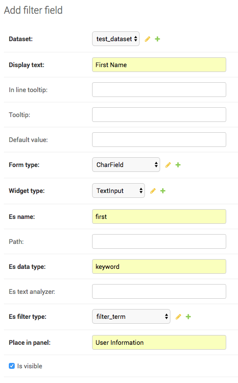

   Figure shows the add filter field page.

The `Display name` field allows the user to specify the name that will be displayed as the text title for the filter
field. This name can be different from the name in Elasticsearch. The `In line tooltip`
field allows the user to display a a tooltip next to the display name. The `Tooltip` field allows the user to specify
a hover-over tooltip associated with the filter field. This can be used to guide the user and explain the filter field.
The `Form type` is one of the three form types that GDW currently supports. The `Widget type` is one of the five types
of Widget that GDW currently supports. The `Es name` is the name of field that will be searched in Elasticsearch.
The `path` field specifies the path of the filter field if it is a nested field. By convention, GDW expects that the path name be prefixed to the `Es name` of any filter field. For example, ES field name will be `friend_name` and the its path name will be `friend`.
The `Es data type` field specifies what Elasticsearch data type the field is such as integer, float, keyword or text.
Finally, the `Es filter type` field allows the user to specify which Elasticsearch type query to use.
Table 1 explains the query types. Not all queries that Elasticsearch can do are currently supported by GDW. Finally,

.. tabularcolumns:: |J|J|

===========================  ===========================================================================================
Es filter type               When to use
===========================  ===========================================================================================
filter_term                  To find documents that contain the exact term specified
filter_terms                 To find documents that contain at least one of the exact terms specified
nested_filter_term           To find documents that contain the exact term specified in a nested field
nested_filter_terms          To find documents that contain at least one of the terms specified in a nested field
filter_range_gte             To find documents with values greater than or equal to specified
filter_range_gt              To find documents with values greater than specified
filter_range_lte             To find documents with values less than or equal to specified
filter_range_lt              To find documents with values less than specified
nested_filter_range_gte      To find documents with values greater than or equal to specified in a nested field
filter_exists                To find documents in which the field specified exists
must_not_exists              To find documents in which the field specified does not exist
nested_filter_exists         To find documents in which the nested field specified exists
===========================  ===========================================================================================

Using the information in table 2, create the remaining filter fields. Figure :numref:`all_filter_fields_listed` shows what the admin site should look after adding the 13 fields.

.. tabularcolumns:: |J|J|J|J|J|J|J|J|J|

====================    ====================    ====================    ====================    ====================    ====================    ====================    ====================    ====================
Dataset                 Display  name           In line tooltip         Form type               Widget type             Es name                 path                    Es data type            Es filter type
====================    ====================    ====================    ====================    ====================    ====================    ====================    ====================    ====================
test_dataset            First Name                                      CharField               Textinput               first                                           keyword                 filter_term
test_dataset            Index                                           CharField               Textinput               index                                           integer                 filter_term
test_dataset            Last Name                                       CharField               Textinput               last                                            keyword                 filter_term
test_dataset            Age                     (<=)                    CharField               Textinput               age                                             integer                 filter_range_lte
test_dataset            Age                     (>=)                    CharField               Textinput               age                                             integer                 filter_range_gte
test_dataset            Is Active                                       ChoiceField             Select                  isActive                                        keyword                 filter_term
test_dataset            Balance                 (<=)                    CharField               Textinput               balance                                         float                   filter_range_lte
test_dataset            Balance                 (>=)                    CharField               Textinput               balance                                         float                   filter_range_gte
test_dataset            Favorite Fruit                                  CharField               Textinput               favoriteFruit                                   keyword                 filter_term
test_dataset            Eye Color                                       MultipleChoiceField     SelectMultiple          eyeColor                                        keyword                 filter_terms
test_dataset            Tag                                             CharField               Textinput               tag                                             text                    filter_term
test_dataset            Friend ID                                       CharField               Textinput               friend_id               friend                  integer                 nested_filter_term
test_dataset            Friend Name                                     CharField               Textinput               friend_name             friend                  text                    nested_filter_term
====================    ====================    ====================    ====================    ====================    ====================    ====================    ====================    ====================

.. _all_filter_fields_listed:
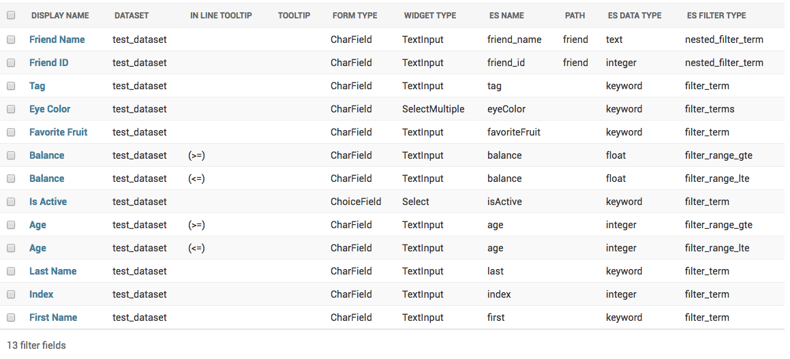

   Figure shows all the filter fields in the admin site.

`ChoiceField` and `MultipleChoiceField` require that you specify choices for them. Click the ``+ Add`` next to the
`Filter Choice Fields`. Click the search icon to open a another window from which you will choose 'Is Active (test-dataset)' for Filter field. This will automatically
put the id of the chosen field in the filter field. Next specify the value `true` and hit save.
Figure :numref:`add_filter_field_choice` shows an example add filter field choice page.

.. _add_filter_field_choice:
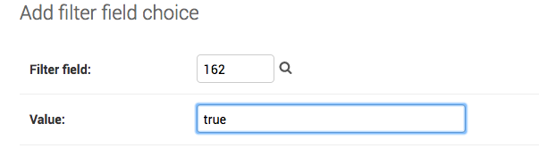

   Figure shows an example of add filter choice field page. Single and multiple select choice fields require that you specify
   the choices. This page is used to add choices.

Next add the value `false` for 'Is Active (test-dataset)'. Similarly for `Eye Color (test_dataset)` add the colors
`brown`, `blue`, `green`. Figure :numref:`all_filter_field_choices` shows what the admin site should look like
after adding five filter field choices.

.. _all_filter_field_choices:
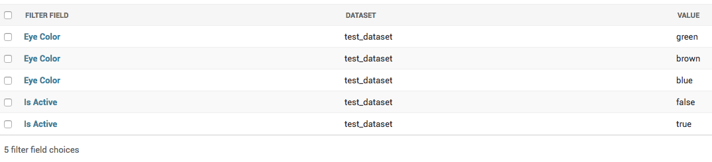

   Figure shows what the admin site should look like after adding some filter field choice options.

Once the filter fields and filter field choices have been created, you now need to create a tab and a panel. Click
``+ Add`` next to ``Filter tabs``. Choose `test_dataset` for Dataset, specify `Basic` for name and hit save.
Figure :numref:`add_filter_tab` shows an example of the add filter tab page.

.. _add_filter_tab:
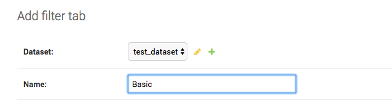

   Figure shows an example of the add filter tab page.

Next we need put all the filter fields in to a panel. Click ``+ Add`` next to ``Filter panels``. Select
`Basic` for Filter tab. Name the panel `Demo Panel` and check all the fields in the `filter fields` div.
Figure :numref:`add_filter_panel` shows the screen for adding a new panel.

.. _add_filter_panel:
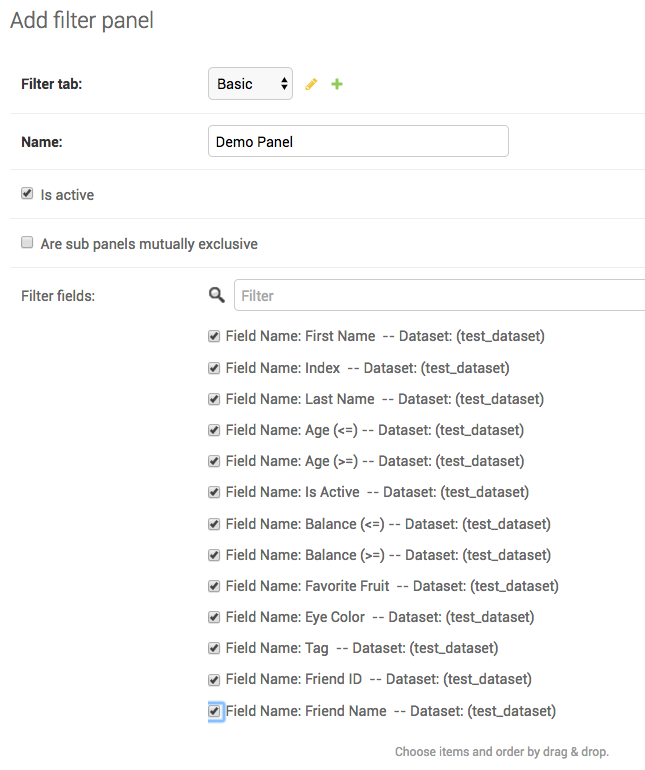

   Figure shows an example of the add filter panel page.

This completes the steps needed to add the filter fields. To recap, there are 7 steps for building the filter UI:

1. Add study
2. Add dataset
3. Add search options
4. Add filter field
5. Add filter field choices if necessary
6. Add tab
7. Add panel

Adding attribute fields
-----------------------------
Next we will add the attribute fields. Table 3 shows the information needed to create the attribute fields. Begin by
adding the attribute fields, then add new attribute tab, and finally add an attribute panel and put all the attribute fields in there.
Figure xxx shows what the admin site should like like after adding the the 11 attribute fields.
Note that you only need one field for age and balance.

.. _all_attribute_fields_listed:
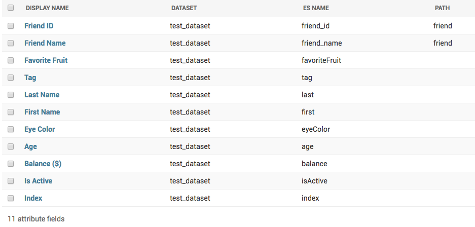

   Figure shows an example of what the admin site should look like after adding all the attribute fields.

.. tabularcolumns:: |J|J|J|

================ ==================== ==================
Display name     Es Name              path
================ ==================== ==================
Index            index                None
Is Active        isActive             None
Balance ($)      balance              None
Age              age                  None
Eye Color        eyeColor             None
First Name       first                None
Last Name        last                 None
Tag              tag                  None
Favorite Fruit   favoriteFruit        None
Friend ID        friend_id            friend
Friend Name      friend_name          friend
================ ==================== ==================

The steps for building the attribute fields GUI, assuming that the study, dataset, and the search options have been
added, are:

1. Add attribute field
2. Add tab
3. Add panel

Now we can start using the GDW GUI to search.

Searching with GDW
=================================================
This section walks you through some search cases to make you familiar with GDW.

Age Search
-------------------------------------------
This use case shows how range filters work and how nested fields are displayed.
Go to http://199.109.xxx.xxx:8000/search/ and select 'test_study' for study and 'Test Dataset' for dataset and click
Next to proceed to the filter selection tab. In the Filter demo panel, enter 29 in the ``Age (>=)`` field. Click Next
to proceed to the attribute selection tab. Click Select All to select all the attribute fields. Uncheck the fields:
`Friend ID` and `Friend Name`. Click Search to search. The result fields are all sortable. You can download the results
using the Download button.

Lets modify the search criteria. Either click the Back button twice or the second circle tab to go back to the filter
tab. Specify 33 for `Age (<=)` and search again. Now all the results should be within age range [29-33]. Go back
to the attribute tab and select the `Friend ID` and `Friend Name` attribute fields and search. You will notice
that now some of the results are repeated. This is because each of the hits have a nested field that has three friends.
GDW is setup to expand the nested structures. This means that each element in the nested structure is combined with
the non-nested results to produce the final results. If there are multiple nested fields, then the final results
is a cross-product of the nested fields. So if there are two nested fields where the first nested fields has three
elements and the second nested field has two elements, this will result in six rows in the results.

Name Search
-------------------------------------------
This use case shows how the name search works and the way Elasticsearch works with strings. Go to
http://199.109.xxx.xxx:8000/search/ and select 'test_study' for study and 'Test Dataset' for dataset and click
Next to proceed to the filter selection tab. In the Filter demo panel, enter `Jeri` in the First name filter field. Click
Next to proceed to the attribute selection tab. Select all the attribute except the two friend attributes. Click Search
to search. You should see just one result. Lets modify this search and change the first name to `jeri`, making
the first name all lower case. Now if you search you should see no results. So what happened? If you remember,
when we defined the first name field in the Elasticsearch mapping, we defined it as a keyword type in Elasticsearch.
This means that Elasticsearch will do an exact match search, meaning the search is case sensitive.

Is Active Search
-------------------------------------------
This use case shows how a single select search works. Go to
http://199.109.xxx.xxx:8000/search/ and select 'test_study' for study and 'Test Dataset' for dataset and click
Next to proceed to the filter selection tab. In the Filter demo panel, select `true` for the ``Is Active`` field. Proceed
to the attribute field and select all the fields except the two friend fields and search. The results should only
show users that are active.

Eye Color Search
-------------------------------------------
This use case shows how a multiple select search works. Go to
http://199.109.xxx.xxx:8000/search/ and select 'test_study' for study and 'Test Dataset' for dataset and click
Next to proceed to the filter selection tab. In the Filter demo panel, select colors `blue` and 'green` for the
``Eye Color`` field. Proceedto the attribute field and select all the fields except the two friend fields and search.
The results should only show users that have blue or green eyes.

Friend Search
-------------------------------------------
This use case shows how nested fields works and discusses the current limitation of GDW.
http://199.109.xxx.xxx:8000/search/ and select 'test_study' for study and 'Test Dataset' for dataset and click
Next to proceed to the filter selection tab. In the Filter demo panel, enter `Greta` in the ``Friend Name``
field. Proceed to the attribute field and select all the fields and search. The results should show only one result.
This search is different from the previous name search that we did. Remember that when we defined the mapping for the
``Friend Name`` field we defined it as type `text`. This means that when Elasticsearch indexes the field,
it splits on spaces and converts strings to lowercase. So the name `Greta Henry` becomes [`greta`, `henry`].
But you can now search for `Greta Henry` using either the first or last name, irrespective of the case.

Rearrange Filter and Attribute Fields
-------------------------------------------
This use case shows how to rearrange the results and to rearrange the filter and attribute fields.
http://199.109.xxx.xxx:8000/search/ and select 'test_study' for study and 'Test Dataset' for dataset and click
Next to proceed to the filter selection tab. In the Filter demo panel, do not select anything. Proceed to the attribute
field and select all the fields except the two friends field and click Search to search. Yo should see eight results.
The arrangement of the results, meaning the columns, is not in a logical order. Maybe the name columns should precede all the
columns except index. You can rearrange the columns in the result by managing the order of the attributes by dragging
the order of the attributes under the Summary div, see Figure xxx. Click search again to rearrange the results.
The rearranged results are also reflected in the Downloaded TSV file.

It is possible to rearrange the filter and attributes in the panels also. Log in to the GDW admin and select the filter
or attribute panel you want to rearrange. Drag and drop the fields to rearrange the order, see Figure xxx. Now when you
search the panels, the fields should be in the order you specified.

Programmatically building the Web User Interface
=================================================
By now you should be familiar with the components of the UI and how it is built using the GDW
admin site. Now we will show you how to do this programmatically. The UI is built by reading a JSON file that defines
the nested hierarchical relationship between the components of the UI. Recall that a study contains datasets. Datasets
are associated filter and attribute tabs. Tabs contain panels and sometimes the panels can contain subpanels. The panels or
subpanels contain the filter and attribute fields. This nested hierarchical relationship is easily represented in a JSON.
THe following JSON shows an example JSON for building a GUI associated with the test dataset. ::

    {
      "study": {
        "name": "Demo Study",
        "description": "This is a Demo Study",
        "dataset": {
          "name": "demo_mon",
          "description": "Test Dataset",
          "es_index_name": "demo_mon",
          "es_type_name": "demo_mon",
          "es_host": "199.109.193.196",
          "es_port": "9200",
          "is_public": true,
          "filters": {
            "tabs": [
              {
                "name": "Basic",
                "panels": [
                  {
                    "name": "User Information",
                    "fields": [
                      {
                        "display_name": "Index",
                        "in_line_tooltip": "",
                        "tooltip": "",
                        "form_type": "CharField",
                        "widget_type": "TextInput",
                        "es_name": "index",
                        "es_filter_type": "filter_term",
                        "path": ""
                      },
                      {
                        "display_name": "First Name",
                        "in_line_tooltip": "",
                        "tooltip": "",
                        "form_type": "CharField",
                        "widget_type": "TextInput",
                        "es_name": "first",
                        "es_filter_type": "filter_term",
                        "path": ""
                      },
                      {
                        "display_name": "Last Name",
                        "in_line_tooltip": "",
                        "tooltip": "",
                        "form_type": "CharField",
                        "widget_type": "TextInput",
                        "es_name": "last",
                        "es_filter_type": "filter_term",
                        "path": ""
                      },
                      {
                        "display_name": "Age",
                        "in_line_tooltip": "(<=)",
                        "tooltip": "",
                        "form_type": "CharField",
                        "widget_type": "TextInput",
                        "es_name": "age",
                        "es_filter_type": "filter_range_lte",
                        "path": ""
                      },
                      {
                        "display_name": "Age",
                        "in_line_tooltip": "(>=)",
                        "tooltip": "",
                        "form_type": "CharField",
                        "widget_type": "TextInput",
                        "es_name": "age",
                        "es_filter_type": "filter_range_gte",
                        "path": ""
                      }
                    ]
                  },
                  {
                    "name": "Account Information",
                    "fields": [
                      {
                        "display_name": "Is Active",
                        "in_line_tooltip": "",
                        "tooltip": "",
                        "form_type": "ChoiceField",
                        "widget_type": "Select",
                        "es_name": "isActive",
                        "es_filter_type": "filter_term",
                        "path": "",
                        "values": [
                          "true",
                          "false"
                        ]
                      },
                      {
                        "display_name": "Balance",
                        "in_line_tooltip": "(<=)",
                        "tooltip": "",
                        "form_type": "CharField",
                        "widget_type": "TextInput",
                        "es_name": "balance",
                        "es_filter_type": "filter_range_lte",
                        "path": ""
                      },
                      {
                        "display_name": "Balance",
                        "in_line_tooltip": "(>=)",
                        "tooltip": "",
                        "form_type": "CharField",
                        "widget_type": "TextInput",
                        "es_name": "balance",
                        "es_filter_type": "filter_range_gte",
                        "path": ""
                      }
                    ]
                  },
                  {
                    "name": "Other Information",
                    "subpanels": [
                      {
                        "name": "Non-nested Fields",
                        "fields": [
                          {
                            "display_name": "Favorite Fruit",
                            "in_line_tooltip": "",
                            "tooltip": "",
                            "form_type": "MultipleChoiceField",
                            "widget_type": "SelectMultiple",
                            "es_name": "favoriteFruit",
                            "es_filter_type": "filter_terms",
                            "path": "",
                            "values": "get_from_es()"
                          },
                          {
                            "display_name": "Eye Color",
                            "in_line_tooltip": "",
                            "tooltip": "",
                            "form_type": "MultipleChoiceField",
                            "widget_type": "SelectMultiple",
                            "es_name": "eyeColor",
                            "es_filter_type": "filter_terms",
                            "path": "",
                            "values": [
                              "blue",
                              "brown",
                              "green"
                            ]
                          },
                          {
                            "display_name": "Tag",
                            "in_line_tooltip": "",
                            "tooltip": "",
                            "form_type": "CharField",
                            "widget_type": "TextInput",
                            "es_name": "tag",
                            "es_filter_type": "filter_term",
                            "path": ""
                          }
                        ]
                      },
                      {
                        "name": "Nested Fields",
                        "fields": [
                          {
                            "display_name": "Friend ID",
                            "in_line_tooltip": "",
                            "tooltip": "",
                            "form_type": "MultipleChoiceField",
                            "widget_type": "SelectMultiple",
                            "es_name": "friend_id",
                            "es_filter_type": "nested_filter_terms",
                            "path": "friend",
                            "values": "get_from_es()"
                          },
                          {
                            "display_name": "Friend Name",
                            "in_line_tooltip": "",
                            "tooltip": "",
                            "form_type": "CharField",
                            "widget_type": "TextInput",
                            "es_name": "friend_name",
                            "es_filter_type": "nested_filter_term",
                            "path": "friend"
                          }
                        ]
                      }
                    ]
                  }
                ]
              }
            ]
          },
          "attributes": {
            "tabs": [
              {
                "name": "Basic",
                "panels": [
                  {
                    "name": "User Information",
                    "fields": [
                      {
                        "display_name": "Index",
                        "es_name": "index",
                        "path": ""
                      },
                      {
                        "display_name": "First Name",
                        "es_name": "first",
                        "path": ""
                      },
                      {
                        "display_name": "Last Name",
                        "es_name": "last",
                        "path": ""
                      },
                      {
                        "display_name": "Age",
                        "es_name": "age",
                        "path": ""
                      }
                    ]
                  },
                  {
                    "name": "Account Information",
                    "fields": [
                      {
                        "display_name": "Is Active",
                        "es_name": "isActive",
                        "path": ""
                      },
                      {
                        "display_name": "Balance",
                        "es_name": "balance",
                        "path": ""
                      }
                    ]
                  },
                  {
                    "name": "Other Information",
                    "subpanels": [
                      {
                        "name": "Non-nested Fields",
                        "fields": [
                          {
                            "display_name": "Favorite Fruit",
                            "es_name": "favoriteFruit",
                            "path": ""
                          },
                          {
                            "display_name": "Eye Color",
                            "es_name": "eyeColor",
                            "path": ""
                          },
                          {
                            "display_name": "Tag",
                            "es_name": "tag",
                            "path": ""
                          }
                        ]
                      },
                      {
                        "name": "Nested Fields",
                        "fields": [
                          {
                            "display_name": "Friend ID",
                            "es_name": "friend_id",
                            "path": "friend"
                          },
                          {
                            "display_name": "Friend Name",
                            "es_name": "friend_name",
                            "path": "friend"
                          }
                        ]
                      }
                    ]
                  }
                ]
              }
            ]
          }
        }
      }
    }

You should be familiar with all the properties except ``values`` for filter fields. The ``values`` property allows
you to define the values for single and multiple select fields. There are three ways to specify the values. First, as an
array of values. Second, by specifying ``get_from_es()``. This method will grab the first 1000 unique values from Elasticsearch.
Third, by specifying a valid Python string that when evaluated results in a Python list. To use this method, put
the Python string inside ``python_eval()``, for example, ::
    "values": "python_eval([str(n) for n in range(23)] + ['X', 'Y', 'MT'])"

When defining the filter fields, you do not need to specify the `Es data type`. This information is automatically fetched
from Elasticsearch based on the name of the field and path, if applicable.

To build the UI using the JSON file, run the following command ::
    python manage.py import_config_from_json search/management/commands/data/demo_mon.json

