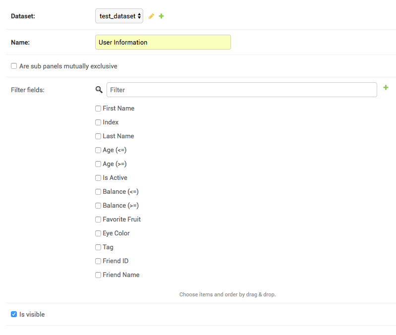
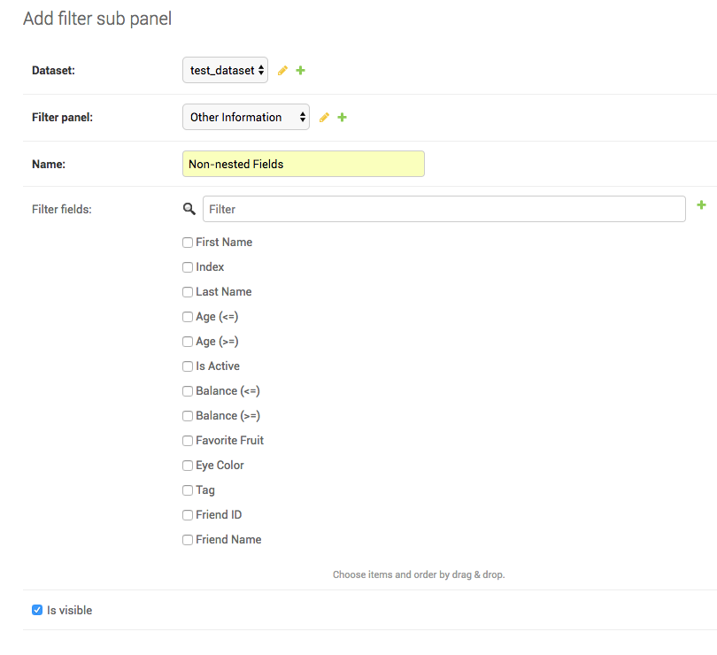
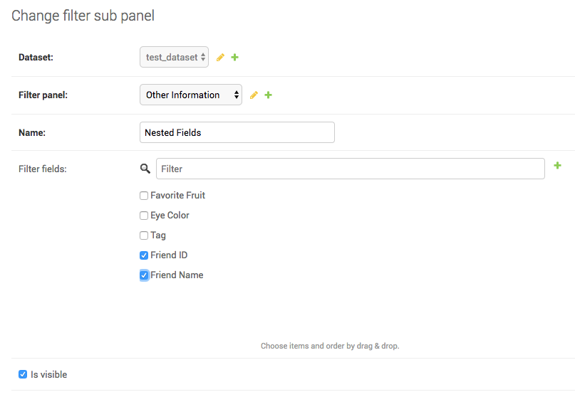
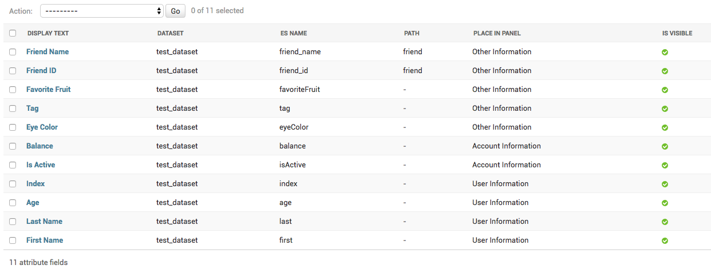

=================================================
Genomics Data Warehouse documentation
=================================================

GDW at a glance
==========================
Genomics Data Warehouse (GDW) is built using Elasticsearch, a distributed RESTful search and analytics engine, and Django, a Python web framework. To use GDW, you need to install Elasticsearch and the GDW Django app.

Installing Elasticsearch
==========================
We assume that GDW will be installed in a Eucalyptus-based cloud environment. The first step is to create a new security group in Eucalyptus. Go to https://console.ccr-cbls-2.ccr.buffalo.edu/securitygroups to create a new security group for your Elasticsearch nodes. In the ``Create new security group`` page, enter a ``Name`` and short ``Description`` in the appropriate boxes.  For your first rule, select SSH protocol and click "Use my IP address" to populate the ``IP address`` box with your local IP address. Click ``ADD RULE``. For the second rule, replicate the first rule except in the ``Port range`` fields enter 9200.

For the purposes of this documentation, an Elasticsearch cluster will be setup with three nodes, i.e., there will be three instances of Elasticsearch running.

To launch the instances, go to https://console.ccr-cbls-2.ccr.buffalo.edu/instances/new. This webpage shows a four step wizard for launching new instances. In the first step, ``1 Image``, select ``Ubuntu 16.04 EBS``, which will automatically advance you to the second step of the wizard, ``2 Details``. In the top-most section of the page, input ``3`` for the ``Number of instances``. Optionally, you can specify a custom name for each instance using the ``Name`` field. For ``Instance type``, choose ``m2.4xlarge: 4 CPUS, 49152 memory (MB)``. Note that for EBS image types, the listed root device storage volume associated with the instance type is ignored. The root storage volume for EBS images is specified elsewhere.

There are two ways to login to your instances. First is using a PEM file generated by the Eucalyptus console. Second is using your SSH public key. The second method is easier, and thus we will use it. The cloud-config script below will be used as a template. Copy and paste it into an empty text file on your local machine and save it. Then update ``name`` to your username, ``gecos`` to your full name, and ``ssh-authorized-keys`` to your SSH public key::

    #cloud-config

    # log all output
    output: {all: '| tee -a /var/log/cloud-init-output.log'}

    users:
      - name: mkzia
        groups: adm
        gecos: Mohammad Zia
        shell: /bin/bash
        sudo: ALL=(ALL) NOPASSWD:ALL
        ssh-authorized-keys:
            - ssh-rsa ASDFSDF mkzia@Mohammads-iMac.local

    # upgrade all packages on initial boot
    package_upgrade: true

    runcmd:
      - timedatectl set-timezone America/New_York
      - updatedb

If you need help generating your SSH key, go to https://ubccr.freshdesk.com/support/solutions/articles/13000025842. If your local machine is running Linux, you can follow the section titled "Generating RSA Keys" at https://help.ubuntu.com/community/SSH/OpenSSH/Keys.

Back at the Eucalyptus console, under the ``USER DATA`` section, select the ``Enter text`` radio button and copy and paste the modified cloud-config script. Alternatively, you can click the ``Upload button`` radio button and upload your saved cloud-config file. After inputting the ``USER DATA``, click the next button to proceed to the next step.

In the third step, ``3 Security``, you will have to choose a ``Key name`` and ``Security group`` to associate with your instances. Create a new key pair if you do not already have one or select a key pair you generated previously . The key pair is your unique PEM file. You will not be using this to log in to your instances, but you need to associate a PEM file with your instances to launch them. In the security group, select the Elasticsearch security group that you created previously. 

Click ``Select advanced options``, which is underneath the ``LAUNCH INSTANCES`` button. In this step, ``4 Advanced``, you will specify the storage volume size. Input 50 GB in the ``STORAGE`` section for the Root volume. Finally, click the ``LAUNCH INSTANCES`` button to launch all three instances. It will take couple of minutes for the instances to be ready for use.

Once the status of your three instances has changed to ``running`` in the Eucalyptus console, you can record some information that's required in subsequent setup steps. Click on the ``NAME (ID)`` of each of the newly-created instances and write down their respective Public and Private IP addresses.

You can now log in to one of your instances by opening up a local terminal and typing ``ssh <Public IP address of instance>``.

Next we will install Elasticsearch on the instance. Begin by doing system updates::

    sudo apt-get update
    sudo apt-get -y upgrade
    sudo apt autoremove

If you receive an error message about locks and "resource temporarily unavailable", wait a few minutes and try the command again. The newly-created instance is running an apt-get process in the background which needs to finish. 

Add repository for installing latest Oracle JAVA::

    sudo add-apt-repository -y ppa:webupd8team/java
    sudo apt-get update

Install JAVA::

    sudo apt-get -y install oracle-java8-installer

Install Elasticsearch::

    wget -qO - https://packages.elastic.co/GPG-KEY-elasticsearch | sudo apt-key add -
    wget https://artifacts.elastic.co/downloads/elasticsearch/elasticsearch-5.5.1.deb
    sudo dpkg -i elasticsearch-5.5.1.deb

Next you will modify Elasticsearch options and update system-wide configurations for optimal Elasticsearch performance. This is best done by becoming root and staying as root for the next series of steps. Become root by issuing the command::

    sudo su -

Open file ``/etc/elasticsearch/jvm.options`` and update the amount of memory Elasticsearch can allocate when it starts up. The amount of memory is set to half the system memory. Our instances were configured with 49156 MB of RAM, so half of that is around 24 GB. You will have to update two lines to allow JVM to allocate 24 GB. WARNING: Never allocate more than 32 GB. Change lines::

    -Xms2g
    -Xmx2g

to::

    -Xms24g
    -Xmx24g

and save and close file.

Next open file ``/etc/elasticsearch/elasticsearch.yml`` and uncomment and update the following lines::

    # Uncomment line and update cluster name
    cluster.name: GDW-Test-Cluster

    # Uncomment line and update node name, e.g., gdw-test-node-1
    node.name: gdw-test-node-xxx

    # Uncomment line to enable JVM memory allocation when Elasticsearch starts
    bootstrap.memory_lock: true

    # Uncomment line and update host IP address
    network.host: 172.17.XX.XXX ### use cloud private and not public address

    # Uncomment line and add private IP addresses of other nodes in cluster.
    discovery.zen.ping.unicast.hosts: ["172.17.XX.XXX", "172.17.XX.XXX"]

and save and close the file. The ``cluster.name`` determines the cluster name. Nodes that share the same ``cluster.name`` are part of an Elasticsearch cluster. Therefore, it is possible to create multiple clusters within a single Eucalyptus security group. Keep in mind when repeating these steps for the other instances that the three instances should have the same ``cluster.name``, but their ``node.name`` should all be different. Setting ``bootstrap.memory_lock`` to ``true`` allocates RAM exclusively for Elasticsearch when it starts up. The ``network.host`` is the private IP address associated with the instance you are logged in to. Update ``discovery.zen.ping.unicast.hosts`` with the private IP addresses of the other two instances.

Next open ``/etc/security/limits.conf``, add limits for Elasticsearch at the end of file::

    # At the end of file add lines:
    elasticsearch - nofile 65536
    elasticsearch soft memlock unlimited
    elasticsearch hard memlock unlimited

save and close the file. These limits allow Elasticsearch to open large number of files at once and allows it to allocate an unlimited amount of page/memory.

Next open ``/usr/lib/systemd/system/elasticsearch.service``, uncomment the following line::

    # Uncomment line to allow elasticsearch to allocate memory at startup
    LimitMEMLOCK=infinity

save, and close.

Next open ``/etc/default/elasticsearch``, uncomment the following lines::

    # Uncomment line to allow elasticsearch to open large amounts of files
    MAX_OPEN_FILES=65536

    # Uncomment line to allow elasticsearch to allocate memory at startup
    MAX_LOCKED_MEMORY=unlimited

save, and close.

Next is the installation of the Elasticsearch free license. The license is valid for one year. To install the license, you have to first install ``X-Pack``, a plug-in for Elasticsearch that manages license and security. To install ``X-Pack`` execute ::

    /usr/share/elasticsearch/bin/elasticsearch-plugin install x-pack

You can ignore the warnings and accept to install the plugin.

Open ``/etc/elasticsearch/elasticsearch.yml`` and disable the proprietary X-pack security by adding the following line at the end of the file::

    xpack.security.enabled: false

save and close.

Next enable Elasticsearch and configure it to start at boot by executing the following lines::

    systemctl daemon-reload
    systemctl enable elasticsearch.service
    systemctl start elasticsearch.service

Test the Elasticsearch installation by going to its public IP address on port 9200::
    http://199.109.XXX.XXX:9200/

To get the free/basic Elasicsearch license, register at https://register.elastic.co/. You should receive an email pointing to a website from which you can download the license to your local machine. Select the license for version 5.X. To install the license, you have to send the license to an Elasticsearch instance twice. In a local terminal, change to the directory on your local machine where the JSON license file is saved. Send the license file to the Elasicsearch instance using CURL from your local machine as follows::

    curl -XPUT 'http://199.109.XXX.XXX:9200/_xpack/license' -d @mohammad-zia-ff462980-7da1-44ce-99f4-26e2952e43fc-v5.json

where you should update the IP address to match your Elasticsearch instance and after the `@` should be the name of your license file. You should receive a message as follows::

    {"acknowledged":false,"license_status":"valid","acknowledge":{"message":"This license update requires acknowledgement. To acknowledge the license, please read the following messages and update the license again, this time with the \"acknowledge=true\" parameter:","watcher":["Watcher will be disabled"],"security":["The following X-Pack security functionality will be disabled: authentication, authorization, ip filtering, and auditing. Please restart your node after applying the license.","Field and document level access control will be disabled.","Custom realms will be ignored."],"monitoring":["Multi-cluster support is disabled for clusters with [BASIC] license. If you are\nrunning multiple clusters, users won't be able to access the clusters with\n[BASIC] licenses from within a single X-Pack Kibana instance. You will have to deploy a\nseparate and dedicated X-pack Kibana instance for each [BASIC] cluster you wish to monitor.","Automatic index cleanup is locked to 7 days for clusters with [BASIC] license."],"graph":["Graph will be disabled"]}}

Send the license again, but this time with acknowledgment::

    curl -XPUT 'http://199.109.XXX.XXX:9200/_xpack/license?acknowledge=true' -d @mohammad-zia-ff462980-7da1-44ce-99f4-26e2952e43fc-v5.json

Check that the license was installed by going to http://199.109.XXX.XXX:9200/_xpack/license. You should see something like::

    {
      "license" : {
        "status" : "active",
        "uid" : "ff462980-7da1-44ce-99f4-26e2952e43fc",
        "type" : "basic",
        "issue_date" : "2017-02-27T00:00:00.000Z",
        "issue_date_in_millis" : 1488153600000,
        "expiry_date" : "2018-02-27T23:59:59.999Z",
        "expiry_date_in_millis" : 1519775999999,
        "max_nodes" : 100,
        "issued_to" : "Mohammad Zia (University at Buffalo)",
        "issuer" : "Web Form",
        "start_date_in_millis" : 1488153600000
      }
    }

You should reboot the system to make sure that Elasticsearch is enabled at boot time. At this point you should have one instance of Elasticsearch running. You can now ssh into the second instance and repeat the setup steps, up to but not including the license installation. The license only needs to be installed on one node of the cluster. Do the same for the third and final instance. 

Finally, check the status of the cluster by going to::

    http://199.109.XXX.XXX:9200/_cluster/health?pretty=true

you should see ``"number_of_data_nodes" : 3``::

    {
      "cluster_name" : "GDW-Test-Cluster",
      "status" : "green",
      "timed_out" : false,
      "number_of_nodes" : 3,
      "number_of_data_nodes" : 3,
      "active_primary_shards" : 3,
      "active_shards" : 6,
      "relocating_shards" : 1,
      "initializing_shards" : 0,
      "unassigned_shards" : 0,
      "delayed_unassigned_shards" : 0,
      "number_of_pending_tasks" : 0,
      "number_of_in_flight_fetch" : 0,
      "task_max_waiting_in_queue_millis" : 0,
      "active_shards_percent_as_number" : 100.0
    }

This completes the installation of Elasticsearch.

.. raw:: latex

    \newpage

Installation checklist for Elasticsearch
=================================================
- [ ] Create a new security group in Eucalyptus for the Elasticsearch nodes
- [ ] Open ports 22 and 9200 to TCP traffic from your local machine in the new security group
- [ ] Launch three instances with new security group
    - [ ] Select Ubuntu 16.04 EBS for image type
    - [ ] Choose ``m2.4xlarge: 4 CPUs, 49152 memory (MB)`` for instance type
    - [ ] Use updated cloud-init script to automate SSH login for your user
    - [ ] Specify storage volume
- [ ] Install Elasticsearch on each instance
    - [ ] Log in
    - [ ] Do system update
    - [ ] Add JAVA repository and update apt-get
    - [ ] Download and install Java and Elasticsearch
    - [ ] Configure Elasticsearch
        - [ ] Become root `` sudo su - ``
        - [ ] Edit ``/etc/elasticsearch/jvm.options``
        - [ ] Edit ``/etc/elasticsearch/elasticsearch.yml``
        - [ ] Edit ``etc/security/limits.conf``
        - [ ] Edit ``/usr/lib/systemd/system/elasticsearch.service``
        - [ ] Edit ``/etc/default/elasticsearch``
        - [ ] Install ``X-pack``
        - [ ] Disable ``X-pack`` security in ``/etc/elasticsearch/elasticsearch.yml``
        - [ ] Enable Elasticsearch at boot
        - [ ] Register and install license * only do this for one instance of the cluster

.. raw:: latex

    \newpage

Installing Genomics Data Warehouse
======================================
First, create a new security group in Eucalyptus for the GDW application instance. Open ports 22 and 8000 (not port 9200!) to TCP traffic from your local machine, following the same procedure as with the Elasticsearch instances. Launch one new instance of image type Ubuntu 16.04 EBS, instance type ``c1.medium: 4 CPUs, 16384 memory (MB)``, and root storage volume of at least 40 GB. You can use the previously modified cloud-config script to automate SSH login to the GDW application instance.

Use the same key pair you used for the Elasticsearch nodes, but this time, use the new GDW application security group instead of the Elasticsearch security group. Beware, the Eucalyptus UI may pre-populate the security group list with your Elasticsearch security group, which is not the one you want in this case.

Next, navigate to https://console.ccr-cbls-2.ccr.buffalo.edu/securitygroups and click on the security group for your Elasticsearch nodes. Add a new rule opening port 9200 to the Public IP address of your new GDW instance. Append "/32" to the end of the IP address or else Eucalyptus will complain about "Valid CIDR entry required."

GDW is built on top of Django. Django requires Python. The best way to install Django is to first create a virtualenv, and then install all the required python packages in the virtualenv using ``pip``. This setup ensures complete isolation of your python installation from the system-wide installation. Note that GDW requires Python version 3.5 because python-memcached only supports Python version upto 3.5. Begin by installing python3 virtual environment, which is not installed by default::

    sudo apt-get install python3-venv

Clone the GDW repository in to your GDW instance::

    git clone https://github.com/ubccr/GDW.git

Change in to GDW directory::

    cd GDW

Install the python virtual environment::

    python3.5 -m venv env

Activate the newly created virtual environment::

    source env/bin/activate

Install the python packages required for GDW, you can ignore the warning messages::

     pip install -r requirements.txt

GDW uses memcached to speed up form loading. Install memcached::

    sudo apt-get install memcached

Create the database tables associated with the app and some default values by executing::

    python manage.py makemigrations msea news pybamview search
    python manage.py migrate
    python manage.py import_es_settings

Create a superuser who can log in to the admin site::

    python manage.py createsuperuser

Open gdw/settings.py and add the instance's Public IP address in the allowed hosts list::

    ALLOWED_HOSTS = ['PUT PUBLIC IP HERE']

save and close file.

Start the development server using the private IP address::

    python manage.py runserver 172.17.XX.XXX:8000

Open a browser on your local machine and navigate to the public IP address, port 8000, of your GDW instance and the GDW website should be running. Most of the functionality will be broken because there is no connection with the Elasticsearch database. You can stop the development server using ``CTRL + c`` inside the terminal that is ssh'd into the GDW instance. Note that the manage.py commands also have to be run inside the virtualenv.

.. raw:: latex

    \newpage

Installation checklist for Genomics Data Warehouse
====================================================
- [ ] Create a new security group for the GDW application in Eucalyptus
- [ ] Open ports 22 and 8000 to TCP traffic from your local machine in the new security group
- [ ] Launch one instance with new security group
    - [ ] Select Ubuntu 16.04 EBS for image type
    - [ ] Choose ``c1.medium: 4 CPUs, 16384 memory (MB)`` for instance type
    - [ ] Use updated cloud-init script to automate SSH login for your user
    - [ ] Specify storage volume, at least 40 GB
- [ ] Open port 9200 in the Elasticsearch security group for TCP traffic from the public IP address of your new instance
- [ ] Install Python3.5 venv
- [ ] Clone GDW repository
- [ ] Create new Python virtualenv and activate it
- [ ] Install the requirements via ``pip``
- [ ] Install memcached
- [ ] Create database tables and import default settings
- [ ] Create superuser
- [ ] Start Dev Instance

.. raw:: latex

    \newpage

Getting familiar with Elasticsearch
=================================================
Now we will import some sample data into Elasticsearch in order to get familiar with it. Traverse to ``GDW/docs/example`` and open the file ``new_data.json``. The file contains seven records that will be imported into Elasticsearch. A sample JSON record is as follows::

    {
        "index": 0,
        "isActive": false,
        "balance": 3696.70,
        "age": 33,
        "eyeColor": "blue",
        "first": "Jeri",
        "last": "Strickland",
        "tag": [
          "aliquip",
          "reprehenderit",
          "cupidatat",
          "occaecat",
          "nostrud"
        ],
        "friend": [
          {
            "friend_id": 0,
            "friend_name": "Greta Henry"
          },
          {
            "friend_id": 1,
            "friend_name": "Macdonald Daniels"
          },
          {
            "friend_id": 2,
            "friend_name": "Blake Kemp"
          }
        ],
        "favoriteFruit": "strawberry"
    }

There are nine fields in each record. Note that the ``friend`` field is a nested field. Elasticsearch is a NoSQL database that stores JSON documents. Before inserting new documents into Elasticsearch, you should define a ''mapping'' of the data. A mapping is a description of the data that indicates to Elasticsearch how to store and query the data.  For example, if something is stored as a float, then Elasticsearch knows that range operators are allowed. If you do not define a mapping, Elasticsearch can automatically guess the mapping, but this may not be optimal. To define a mapping, we will use the Python 3 API for Elasticsearch. Make sure that Python virtual environment is activated and install the package::

    pip install elasticsearch

The following is a possible mapping for the JSON shown previously::

    'properties': {
        'index':            {'type' : 'integer'},
        'isActive':         {'type' : 'keyword'},
        'balance':          {'type' : 'float'},
        'age':              {'type' : 'integer'},
        'eyeColor':         {'type' : 'keyword'},
        'first':            {'type' : 'keyword'},
        'last':             {'type' : 'keyword'},
        'tag':              {'type' : 'text'},
        'friend' : {
            'type' : 'nested',
            'properties' : {
                'friend_id':    {'type' : 'integer'},
                'friend_name':  {'type' : 'text'},
            }
        },
        'favoriteFruit':    {'type' : 'keyword'}
    }

The ``index`` and ``age`` fields are defined as integer. Likewise for the nested ``friend_id`` field. It is not a requirement of Elasticsearch that the name of nested fields begin with ``friend_``, i.e.,but it is a convention of GDW. The ``balance`` field is defined as a float. The fields ``isActive``, ``eyeColor``, ``first``, ``last``, and ``favoriteFruit`` are defined as keyword. Keyword mappings indicate to Elasticsearch that an exact match is required, meaning they are case sensitive and spaces are significant. The ``tag`` and ``friend_name`` fields are defined as text. The default text analyzer for Elasticsearch converts all strings to lower case, splits on spaces and removes punctuation. As an example, `John Doe` will become `john` and `doe`, so searching on ``john`` or ``doe`` will return a hit, but not ``John`` or ``DOE``.

We will now put the mapping in Elasticsearch using ``create_index.py``. Open the file for editing. Update the IP address to an Elasticsearch node ::

    # Update the IP address
    es = elasticsearch.Elasticsearch(host="199.109.XXX.XX")

Now we will walk through the Python script and explain it.

``es = elasticsearch.Elasticsearch(host="199.109.XXX.XX")`` establishes a connection to your Elasticsearch cluster.

``INDEX_NAME = 'demo_mon'`` specifies the ``INDEX_NAME``. Index name in Elasticsearch is loosely equivalent to database name in MySQL.

``type_name = 'demo_mon'`` specifies the ``type_name``. Type name in Elasticsearch is loosely equivalent to a table name, but in Elasticsearch it is a name of a type of document that will be stored in an index. The subsequent conditional deletes
the index if it already exists. The following lines define the mapping previously discussed::

    mapping = {
        type_name: {
            'properties': {
                'index':            {'type' : 'integer'},
                'isActive':         {'type' : 'keyword'},
                'balance':          {'type' : 'float'},
                'age':              {'type' : 'integer'},
                'eyeColor':         {'type' : 'keyword'},
                'first':            {'type' : 'keyword'},
                'last':             {'type' : 'keyword'},
                'tag':              {'type' : 'text'},
                'friend' : {
                    'type' : 'nested',
                    'properties' : {
                        'friend_id':    {'type' : 'integer'},
                        'friend_name':  {'type' : 'text'},
                    }
                },
                'favoriteFruit':    {'type' : 'keyword'}
            }
        }
    }

``es.indices.put_mapping(index=INDEX_NAME, doc_type=type_name, body=mapping)`` puts the mapping in Elasticsearch. Run the script after updating the IP address to put the mapping into Elasticsearch. You can verify that the mapping has been put into Elasticsearch by going to http://199.109.XXX.XXX:9200/demo_mon/demo_mon/_mapping?pretty=true

Next open the file ``insert_index.py``. This script reads the data contained in ``new_data.json`` and inserts it in to Elasticsearch. Run the script after updating the IP address. You can verify that the data has been imported by going to http://199.109.XXX.XXX:9200/demo_mon/demo_mon/_search?pretty=true. Now we will make some queries using Elasticsearch through the REST API.

For all the following scripts, update the IP address before running them. The scripts are located in ``GDW/docs/example``. 

Execute ``bash query1.es`` to find all the active users.  ::

    curl -XGET 'http://199.109.XXX.XXX:9200/demo_mon/demo_mon/_search?pretty=true' -d '
    {
        "query": {
            "bool": {
                "filter": [{"term": {"isActive": "true"}}]}},
        "size": 1000
    }
    '

Execute ``bash query2.es`` to find all users whose age is greater than or equal to 26 ::

    curl -XGET 'http://199.109.XXX.XXX:9200/demo_mon/demo_mon/_search?pretty=true' -d '
    {
        "query": {
            "range" : {
                "age" : {
                    "gte" : 26
                }
            }
        }
    }
    '

Execute ``bash query3.es`` to find users with friend named `tanner` ::

    curl -XGET 'http://199.109.XXX.XXX:9200/demo_mon/demo_mon/_search?pretty=true' -d '
    {
        "query": {
            "nested" : {
                "path" : "friend",
                "query" : {
                    "bool" : {
                        "filter" : { "term" : {"friend.friend_name" : "tanner"} }
                    }
                }
            }
        }
    }
    '

Notice that the whole JSON document is returned along with the other nested friends and not just `tanner`. This is how Elasticsearch works. GDWfilters the irrelevant nested terms.  As you can see, the search query string can become unwieldy. Next we will learn how to create a GUI in GDW to make queries with Elasticsearch convenient.

Building the GDW Web User Interface
============================================
Basically GDW provides a web-based user interface (UI) to make Elasticsearch queries. There are two ways to build the UI.
First, by logging in to the GDW admin site and building the UI by clicking through it. This is quite flexible, but can become very tedious. Second, by programmatically building the UI by reading a JSON file that defines the fields of the UI. Both ways will be described to make you familiar with how GDW works. They are complementary
because in practice the UI is initially built programmatically and then modified and tweaked using the GDW admin site. We begin by showing you how to build the UI using the GDW admin site.

Before you can begin building the UI, you need to become familiar with how its components are organized.

.. _component_1:
.. figure:: images/component_1.png
   :scale: 75 %
   :alt: UI components 1

   Figure shows the components that make up the web-based user interface (UI) of GDW. Filter fields, example `Variant Name`, are put inside panels, example `Variant Related Information`. Panels are put inside a tab, example `Simple`.
   Tabs are associated with a dataset. Datasets are associated with a study.

Figure :numref:`component_1` shows the components of the UI. Fields used for filtering are put inside a panel. Panels are used to logically group filter fields. Panels can also also contain sub-panels that in turn can contain filter fields.
Sub-panels allows further grouping of filter fields within a panel. Figure :numref:`component_2` shows an example of a sub-panel. Panels themselves are put inside a tab. Tabs can be used to separate panels into different groups such as `basic` and `advanced` search fields.

.. _component_2:
.. figure:: images/component_2.png
   :scale: 75 %
   :alt: UI components 2

   Figure shows an example of how sub-panels can be used to further organize filter fields with a panel.

GDW allows a user to select which fields they want to display in the search results. This allows a user to include more, less, or different fields in the search results than the ones used for searching. The result fields are called `attributes` – we are selecting the attributes of the filtered data that we want to see. Attribute fields are organized in a similar manner to filter fields. Attribute fields are placed inside panels to logically group them. Panels can contain sub-panels. Panels are placed inside tabs. Both the filter and attribute tabs are associated with a dataset. Datasets are associated with a study. Finally, a study can contain multiple datasets.

Adding study, dataset, and search options
--------------------------------------------
To begin building the UI, log in to the admin site by going to http://199.109.XXX.XXX:8000/admin. Make sure that the development server is running. Use the username and password that you used to create the ``superuser``. First we will add a new study by clicking the ``+ Add`` button next to ``Studies``, see Figure :numref:`add_study`. In the ``Add Study`` page, see Figure :numref:`add_study_page`, specify a name for the study. You can also add a description, but this is optional as indicated by the non-bold text label. Hit the save button to create the study. Click on the `home` link in the breadcrumb navigation to return to the admin home page.

.. _add_study:
.. figure:: images/add_study.png
   :scale: 75 %
   :alt: Add Study

   Figure shows the ``+ Add`` button that is used to add a new study.

.. _add_study_page:
.. figure:: images/add_study_page.png
   :scale: 75 %
   :alt: Add Study Page

   Figure shows the Add study page. This page is used to add and update a study.

Next we will add a dataset that is associated with the study that we just added. Click ``+ Add`` button next to ``Datasets``. Select the study that you just added from the drop down menu. Fill in the dataset name and description field. Next fill in ``Es index name``, ``Es type name``, ``Es host``, and ``Es port``, which should be
`demo_mon`, `demo_mon`, the public IP address to the Elasticsearch node instance, and 9200, respectively. Check the ``is_public`` field to make the demo dataset accessible by all. The allowed groups field allows you to manage which groups can access the dataset if you want to restrict access to the dataset. User permissions will be described in detail later. Figure :numref:`add_dataset_page` shows the add dataset page with the fields filled. Click on the `home` link in the breadcrumb navigation to return to the admin home page.

.. _add_dataset_page:
.. figure:: images/add_dataset_page.png
   :scale: 75 %
   :alt: Add Dataset Page

   Figure shows the add dataset page. This page is used to add and update a dataset.

Next we need to add search options for the dataset. A dataset can contain millions of documents. Displaying so many results can cause rendering issues, so we use search options to limit the number of results that are shown to 400 documents. If you want to to fetch all the results, you can download them from the search results page. To add the default search options, click the ``+ Add`` button next to ``Search options``. Choose the dataset you just added and leave the other values to the default and click SAVE. Figure :numref:`add_search_options_page` shows the page for adding searching options for a dataset.

.. _add_search_options_page:
.. figure:: images/add_search_options_page.png
   :scale: 75 %
   :alt: Add Search Options Page

   Figure shows the Add search options page. This page is used to add and update the search options associated with a dataset. Search options limit the number of results returned matching the search criteria.

Adding filter fields
---------------------------
Now we are ready to add filter fields. Currently GDW supports three types of forms for filter fields: ``CharField``, ``ChoiceField`` and ``MultipleChoiceField``. The ``CharField`` can use three types of form widget: ``TextInput``, ``TextArea``, and ``UploadField``. The ``TextInput`` widget is a simple text input box that allows the user to search for a single term. The ``TextArea`` is also a text input box but allows rows of terms. Finally, the ``UploadField`` uses the ``TextArea`` widget but with an extra upload button that allows users to select a file from which to populate the ``TextArea`` widget. The ``TextArea`` and ``UploadField`` widgets allow users to search for multiple terms. The ``ChoiceField`` uses the ``Select`` widget
that renders a single-select drop down menu for selecting a single term to search for from a list of choices. And the ``MultipleChoiceField`` field uses a ``SelectMultiple`` widget that renders a multi-select field to allow users to select multiple terms to search for from a list of choices.

Click ``+ Add`` button next to the ``Filter Fields``. Select ``test_dataset`` for Dataset, fill in ``Display name``, ``Form type``, ``Widget type``, ``Es name``, ``Es data type``, and ``Es filter type``, ``Place in panel`` with ``First Name``, ``CharField``, ``TextArea``, ``first``, ``keyword``, ``filter_term``, and ``User Information``, respectively. Hit save to create the field. Figure :numref:`add_filter_field_page` shows an example page for adding a filter field.

.. _add_filter_field_page:
.. figure:: images/add_filter_field_page.png
   :scale: 75 %
   :alt: Add Filter Field Page

   Figure shows the add filter field page.

The ``Display name`` field allows the user to specify the name that will be displayed as the text label for the filter field. This name can be different from the name in Elasticsearch. The ``In line tooltip`` field allows the user to display a tooltip next to the display name. The ``Tooltip`` field allows the user to specify
a hover-over tooltip associated with the filter field. This can be used to guide the user and explain the filter field. The ``Form type`` is one of the three form types that GDW currently supports. The ``Widget type`` is one of the five types of Widget that GDW currently supports. The ``Es name`` is the name of field that will be searched in Elasticsearch.The ``path`` field specifies the path of the filter field if it is a nested field. By convention, GDW expects that the path name and an underscore be prefixed to the ``Es name`` of the nested filter field. For example, the nested ES field name of ``friend_name`` has the path name of ``friend``. The ``Es data type`` field specifies what Elasticsearch data type the field is such as integer, float, keyword or text. ``Es text analyzer`` specifics the Elasticsearch text analyzer to use if the ``Es data type`` is set to text. See https://www.elastic.co/guide/en/elasticsearch/reference/current/analysis-analyzers.html
for details about the various analyzers. The ``Es filter type`` field allows the user to specify which Elasticsearch type query to use. The ``Place in panel`` is used internally by GDW for properly displaying the available filter fields for a given dataset. It should be the ``display_name`` of the panel the filter field is associated with. Finally, the ``Is visible`` field is  used to show or hide filter fields. Table 1 explains the query types. Not all queries that Elasticsearch can do are currently supported by GDW.

.. tabularcolumns:: |J|J|

===========================  ===========================================================================================
Es filter type               When to use
===========================  ===========================================================================================
filter_term                  To find documents that contain the exact term specified
filter_terms                 To find documents that contain at least one of the exact terms specified
nested_filter_term           To find documents that contain the exact term specified in a nested field
nested_filter_terms          To find documents that contain at least one of the terms specified in a nested field
filter_range_gte             To find documents with values greater than or equal to specified
filter_range_gt              To find documents with values greater than specified
filter_range_lte             To find documents with values less than or equal to specified
filter_range_lt              To find documents with values less than specified
nested_filter_range_gte      To find documents with values greater than or equal to specified in a nested field
filter_exists                To find documents in which the field specified exists
must_not_exists              To find documents in which the field specified does not exist
nested_filter_exists         To find documents in which the nested field specified exists
===========================  ===========================================================================================

Using the information in table 2, create the remaining filter fields. Figure :numref:`all_filter_fields_listed` shows what the admin site should look after adding the 13 fields. Note that the dataset for all the filter fields is ``test_dataset``.

+----------------+-----------------+---------------------+----------------+---------------+--------+--------------+--------------------+---------------------+
| Display name   | in line tooltip | Form type           | Widget Type    | ES Name       | Path   | ES Data Type | ES Filter Type     | Place in Panel      |
+================+=================+=====================+================+===============+========+==============+====================+=====================+
| First Name     |                 | CharField           | Textinput      | first         |        | keyword      | filter_term        | User Information    |
+----------------+-----------------+---------------------+----------------+---------------+--------+--------------+--------------------+---------------------+
| Index          |                 | CharField           | Textinput      | index         |        | integer      | filter_term        | User Information    |
+----------------+-----------------+---------------------+----------------+---------------+--------+--------------+--------------------+---------------------+
| Last Name      |                 | CharField           | Textinput      | last          |        | keyword      | filter_term        | User Information    |
+----------------+-----------------+---------------------+----------------+---------------+--------+--------------+--------------------+---------------------+
| Age            | (<=)            | CharField           | Textinput      | age           |        | integer      | filter_range_lte   | User Information    |
+----------------+-----------------+---------------------+----------------+---------------+--------+--------------+--------------------+---------------------+
| Age            | (>=)            | CharField           | Textinput      | age           |        | integer      | filter_range_gte   | User Information    |
+----------------+-----------------+---------------------+----------------+---------------+--------+--------------+--------------------+---------------------+
| Is Active      |                 | ChoiceField         | Select         | isActive      |        | keyword      | filter_term        | Account Information |
+----------------+-----------------+---------------------+----------------+---------------+--------+--------------+--------------------+---------------------+
| Balance        | (<=)            | CharField           | Textinput      | balance       |        | float        | filter_range_lte   | Account Information |
+----------------+-----------------+---------------------+----------------+---------------+--------+--------------+--------------------+---------------------+
| Balance        | (>=)            | CharField           | Textinput      | balance       |        | float        | filter_range_gte   | Account Information |
+----------------+-----------------+---------------------+----------------+---------------+--------+--------------+--------------------+---------------------+
| Favorite Fruit |                 | CharField           | Textinput      | favoriteFruit |        | keyword      | filter_term        | Other Information   |
+----------------+-----------------+---------------------+----------------+---------------+--------+--------------+--------------------+---------------------+
| Eye Color      |                 | MultipleChoiceField | SelectMultiple | eyeColor      |        | keyword      | filter_terms       | Other Information   |
+----------------+-----------------+---------------------+----------------+---------------+--------+--------------+--------------------+---------------------+
| Tag            |                 | CharField           | Textinput      | tag           |        | text         | filter_term        | Other Information   |
+----------------+-----------------+---------------------+----------------+---------------+--------+--------------+--------------------+---------------------+
| Friend ID      |                 | CharField           | Textinput      | friend_id     | friend | integer      | nested_filter_term | Other Information   |
+----------------+-----------------+---------------------+----------------+---------------+--------+--------------+--------------------+---------------------+
| Friend Name    |                 | CharField           | Textinput      | friend_name   | friend | text         | nested_filter_term | Other Information   |
+----------------+-----------------+---------------------+----------------+---------------+--------+--------------+--------------------+---------------------+

.. _all_filter_fields_listed:
.. figure:: images/all_filter_fields_listed.png
   :scale: 75 %
   :alt: All Filter Fields Listed

   Figure shows all the filter fields in the admin site.

``ChoiceField`` and ``MultipleChoiceField`` require that you specify choices for them. Click the ``+ Add`` next to the ``Filter Choice Fields``. Click the search (magnifying glass) icon to open a another window from which you will choose ``Is Active (test-dataset)`` for Filter field. This will automatically put the ID of the chosen field in the filter field. Next specify the value ``true`` and hit save.
Figure :numref:`add_filter_field_choice` shows an example add filter field choice page.

.. _add_filter_field_choice:
.. figure:: images/add_filter_field_choice.png
   :scale: 75 %
   :alt: Add Filter Field Choice Page

   Figure shows an example of an add filter choice field page. Single and multiple select choice fields require that you specify the choices. This page is used to add choices.

Next add the value ``false`` for ``Is Active (test-dataset)``. Similarly for ``Eye Color (test_dataset)`` add the colors ``brown``, ``blue``, ``green``. Figure :numref:`all_filter_field_choices` shows what the admin site should look like after adding five filter field choices.

.. _all_filter_field_choices:
.. figure:: images/all_filter_field_choices.png
   :scale: 75 %
   :alt: List Filter Filed Choices

   Figure shows what the admin site should look like after adding some filter field choice options.

Once the filter fields and filter field choices have been created, you now need to create three panels and a tab. Click ``+ Add`` next to ``Filter panels``. Choose ``test_dataset`` for Dataset and input ``User Information`` name and and hit save.
Figure :numref:`add_filter_panel` shows the add filter page.

.. _add_filter_panel:

   Figure shows an example of an add filter panel page.

After you hit save, you should see a page for selecting filter panel. This page should list only one name – ``User Information``. Click on ``User Information``, which will lead you to a page to edit the new panel you created. Notice that this time the ``Filter fields`` section has less options to select from, see Figure :numref:`edit_filter_panel`.

.. _edit_filter_panel:
.. figure:: images/edit_filter_panel.png
   :scale: 75 %
   :alt: Edit Filter Panel

   Figure shows an example of a change filter panel page with filtered lists of filter fields available for selection.

This is because when we created the filter fields, we specified ``Place in panel`` field. This field is used to filter the list of available filter fields you can add to a panel, but only after the panel has been created with a ``Name`` that matches the ``Place in panel`` field of a filter field. Check all the filter fields and hit SAVE. Now create two more panels: ``Account Information`` and ``Other Information``. For both panels, first just create the panels with the name only, not adding any filter fields to the panel. Then for the ``Account Information``, edit it after it has been created and add the fields listed in the ``Filter fields``. For the ``Other Information`` panel, we will not add the filter fields. Rather, we will first create subpanels and then associate the filter fields with them.

Click the ``+ Add`` next to ``Filter sub panels``. For ``Dataset`` select ``test_dataset``, for ``Filter panel`` select ``Other Information``, for ``Name`` input ``Non-nested Fields`` and hit SAVE, see Figure :numref:`edit_filter_sub_panel`. In the sub panel to change page, click ``Non-nested Fields`` panel to edit. Select ``Favorite Fruit``, ``Eye Color``, and ``Tag`` and hit SAVE, see Figure :numref:`edit_filter_sub_panel2`.

.. _edit_filter_sub_panel:

   Figure shows an example of a change filter subpanel page without filtered lists of filter fields available for selection.

.. _edit_filter_sub_panel2:
.. figure:: images/edit_filter_sub_panel2.png
   :scale: 75 %
   :alt: Edit Filter subpanel

   Figure shows an example of a change filter subpanel page with filtered lists of filter fields available for selection.

Next create another subpanel called ``Nested Fields`` and click SAVE, and then add filter fields ``Friend ID`` and ``Friend Name``, see Figure :numref:`edit_nested_panel`.

.. _edit_nested_panel:

   Figure shows an example of a change filter subpanel page with filtered lists of filter fields available for selection.

Finally, click ``+ Add`` next to ``Filter tabs``. Input ``Basic`` for name and select all three panels and hit SAVE, see Figure :numref:`add_filter_tab` shows an example of the add filter tab page.

.. _add_filter_tab:
.. figure:: images/add_filter_tab.png
   :scale: 75 %
   :alt: List Filter Filed Choices

   Figure shows an example of the add filter tab page.

This completes the steps needed to add the filter fields. To recap, there are 7 steps for building the filter UI:

1. Add study
2. Add dataset
3. Add search options
4. Add filter fields
5. Add filter field choices if necessary
6. Add panels
7. Add subpanels if necessary
8. Add tab

Adding attribute fields
-----------------------------
Next we will add the attribute fields. Table 3 shows the information needed to create the attribute fields. Begin by adding the attribute fields, then add new attribute tab, and finally add an attribute panel and put all the attribute fields in there. Figure xxx shows what the admin site should like like after adding the the 11 attribute fields. Note that you only need one field for age and balance.

.. _all_attribute_fields_listed:
.. figure:: images/all_attribute_fields_listed.png
   :scale: 75 %
   :alt: List Filter Filed Choices

   Figure shows an example of what the admin site should look like after adding all the attribute fields.

+----------------+---------------+--------+---------------------+
| Display Name   | ES Name       | path   | Place in Panel      |
+================+===============+========+=====================+
| First Name     | first         |        | User Information    |
+----------------+---------------+--------+---------------------+
| Last Name      | last          |        | User Information    |
+----------------+---------------+--------+---------------------+
| Age            | age           |        | User Information    |
+----------------+---------------+--------+---------------------+
| Index          | index         |        | User Information    |
+----------------+---------------+--------+---------------------+
| Is Active      | isActive      |        | Account Information |
+----------------+---------------+--------+---------------------+
| Balance        | balance       |        | Account Information |
+----------------+---------------+--------+---------------------+
| Eye Color      | eyeColor      |        | Other Information   |
+----------------+---------------+--------+---------------------+
| Tag            | tag           |        | Other Information   |
+----------------+---------------+--------+---------------------+
| Favorite Fruit | favoriteFruit |        | Other Information   |
+----------------+---------------+--------+---------------------+
| Friend ID      | friend_id     | friend | Other Information   |
+----------------+---------------+--------+---------------------+
| Friend Name    | friend_name   | friend | Other Information   |
+----------------+---------------+--------+---------------------+

The steps for building the attribute fields GUI, assuming that the study, dataset, and the search options have been added, are:

1. Add attribute fields
2. Add panels
3. Add subpanels if necessary
4. Add tab

Figure :numref:`attribute_fields` shows the attribute fields.

.. _attribute_fields:

   Figure shows all the attribute fields added

Now we can start using the GDW GUI to search.

Searching with GDW
=================================================
This section walks you through some search cases to make you familiar with GDW.

Age Search
-------------------------------------------
This use case shows how range filters work and how nested fields are displayed.
Go to http://199.109.xxx.xxx:8000/search/ and select 'test_study' for study and 'Test Dataset' for dataset and click Next to proceed to the filter selection tab. In the Filter demo panel, enter 29 in the ``Age (>=)`` field. Click Next to proceed to the attribute selection tab. Click Select All to select all the attribute fields. Uncheck the fields: `Friend ID` and `Friend Name`. Click Search to search. The result fields are all sortable. You can download the results using the Download button.

Let's modify the search criteria. Either click the Back button twice or the second circle tab to go back to the filter tab. Specify 33 for `Age (<=)` and search again. Now all the results should be within age range [29-33]. Go back to the attribute tab and select the `Friend ID` and `Friend Name` attribute fields and search. You will notice that now some of the results are repeated. This is because each of the hits have a nested field that has three friends. GDW is setup to expand the nested structures. This means that each element in the nested structure is combined with
the non-nested results to produce the final results. If there are multiple nested fields, then the final result is a cross-product of the nested fields. So if there are two nested fields where the first nested fields has three elements and the second nested field has two elements, this will result in six rows in the results.

Name Search
-------------------------------------------
This use case shows how the name search works and the way Elasticsearch works with strings. Go to http://199.109.xxx.xxx:8000/search/ and select 'test_study' for study and 'Test Dataset' for dataset and click Next to proceed to the filter selection tab. In the Filter demo panel, enter `Jeri` in the First name filter field. Click
Next to proceed to the attribute selection tab. Select all the attributes except the two friend attributes. Click Search to search. You should see just one result. Lets modify this search and change the first name to `jeri`, making the first name all lower case. Now if you search you should see no results. So what happened? If you remember, when we defined the first name field in the Elasticsearch mapping, we defined it as a keyword type in Elasticsearch. This means that Elasticsearch will do an exact match search, meaning the search is case sensitive.

Is Active Search
-------------------------------------------
This use case shows how a single select search works. Go to http://199.109.xxx.xxx:8000/search/ and select 'test_study' for study and 'Test Dataset' for dataset and click Next to proceed to the filter selection tab. In the Filter demo panel, select `true` for the ``Is Active`` field. Proceed to the attribute field and select all the fields except the two friend fields and search. The results should only show users that are active.

Eye Color Search
-------------------------------------------
This use case shows how a multiple select search works. Go to
http://199.109.xxx.xxx:8000/search/ and select 'test_study' for study and 'Test Dataset' for dataset and click Next to proceed to the filter selection tab. In the Filter demo panel, select colors `blue` and 'green` for the ``Eye Color`` field. Proceed to the attribute field and select all the fields except the two friend fields and search. The results should only show users that have blue or green eyes.

Friend Search
-------------------------------------------
This use case shows how nested fields work and discusses the current limitations of GDW. Go to http://199.109.xxx.xxx:8000/search/ and select 'test_study' for study and 'Test Dataset' for dataset and click Next to proceed to the filter selection tab. In the Filter demo panel, enter `Greta` in the ``Friend Name`` field. Proceed to the attribute field and select all the fields and search. The results should show only one result. This search is different from the previous name search that we did. Remember that when we defined the mapping for the ``Friend Name`` field we defined it as type `text`. This means that when Elasticsearch indexes the field, it splits on spaces and converts strings to lowercase. So the name `Greta Henry` becomes [`greta`, `henry`]. But you can now search for `Greta Henry` using either the first or last name, irrespective of the case.

Rearrange Filter and Attribute Fields
-------------------------------------------
This use case shows how to rearrange the results and to rearrange the filter and attribute fields. Go to http://199.109.xxx.xxx:8000/search/ and select 'test_study' for study and 'Test Dataset' for dataset and click Next to proceed to the filter selection tab. In the Filter demo panel, do not select anything. Proceed to the attribute field and select all the fields except the two friends field and click Search to search. You should see eight results. You can rearrange the columns in the result by managing the order of the attributes by dragging the order of the attributes under the Summary div. Click search again to rearrange the results. The rearranged results are also reflected in the Downloaded TSV file.

It is possible to rearrange the filter and attributes in the panels also. Log in to the GDW admin and select the filter or attribute panel you want to rearrange. Drag and drop the fields to rearrange the order. Now when you search the panels, the fields should be in the order you specified.

Programmatically building the Web User Interface
=================================================
By now you should be familiar with the components of the UI and how it is built using the GDW admin site. Now we will show you how to do this programmatically. The UI is built by reading a JSON file that defines for each data type its location in the UI.  The following JSON shows an example JSON for building a UI associated with the test dataset. ::

    {
      "index": {
        "filters": [
          {
            "display_text": "Index",
            "es_filter_type": "filter_term",
            "form_type": "CharField",
            "widget_type": "TextInput"
          }
        ],
        "panel": "User Information",
        "tab": "Simple"
      },
      "first": {
        "filters": [
          {
            "display_text": "First Name",
            "es_filter_type": "filter_term",
            "form_type": "CharField",
            "widget_type": "TextInput"
          }
        ],
        "panel": "User Information",
        "tab": "Simple"
      },
      "last": {
        "filters": [
          {
            "display_text": "Last Name",
            "es_filter_type": "filter_term",
            "form_type": "CharField",
            "widget_type": "TextInput"
          }
        ],
        "panel": "User Information",
        "tab": "Simple"
      },
      "age": {
        "filters": [
          {
            "display_text": "Age",
            "es_filter_type": "filter_range_lte",
            "form_type": "CharField",
            "in_line_tooltip": "(<=)",
            "widget_type": "TextInput"
          },
          {
            "display_text": "Age",
            "es_filter_type": "filter_range_gte",
            "form_type": "CharField",
            "in_line_tooltip": "(>=)",
            "widget_type": "TextInput"
          }
        ],
        "panel": "User Information",
        "tab": "Simple"
      },
      "isActive": {
        "filters": [
          {
            "display_text": "Is Active",
            "es_filter_type": "filter_term",
            "form_type": "ChoiceField",
            "widget_type": "Select",
            "values": "get_from_es()"
          }
        ],
        "panel": "Account Information",
        "tab": "Simple"
      },
      "balance": {
        "filters": [
          {
            "display_text": "Balance",
            "es_filter_type": "filter_range_lte",
            "form_type": "CharField",
            "widget_type": "TextInput",
            "in_line_tooltip": "(<=)"
          },
          {
            "display_text": "Balance",
            "es_filter_type": "filter_range_gte",
            "form_type": "CharField",
            "widget_type": "TextInput",
            "in_line_tooltip": "(>=)"
          }
        ],
        "panel": "Account Information",
        "tab": "Simple"
      },
      "favoriteFruit": {
        "filters": [
          {
            "display_text": "Favorite Fruit",
            "es_filter_type": "filter_term",
            "form_type": "CharField",
            "widget_type": "TextInput"
          }
        ],
        "panel": "Other Information",
        "sub_panel": "Non-nested Fields",
        "tab": "Simple"
      },
      "eyeColor": {
        "filters": [
          {
            "display_text": "Eye Color",
            "es_filter_type": "filter_terms",
            "form_type": "MultipleChoiceField",
            "widget_type": "SelectMultiple",
            "values": "get_from_es()"
          }
        ],
        "panel": "Other Information",
        "sub_panel": "Non-nested Fields",
        "tab": "Simple"
      },
      "tag": {
        "filters": [
          {
            "display_text": "Tag",
            "es_filter_type": "filter_term",
            "form_type": "CharField",
            "widget_type": "TextInput"
          }
        ],
        "panel": "Other Information",
        "sub_panel": "Non-nested Fields",
        "tab": "Simple"
      },
      "friend_id": {
        "filters": [
          {
            "display_text": "Friend ID",
            "es_filter_type": "nested_filter_term",
            "form_type": "CharField",
            "widget_type": "TextInput"
          }
        ],
        "panel": "Other Information",
        "sub_panel": "Nested Fields",
        "tab": "Simple"
      },
      "friend_name": {
        "filters": [
          {
            "display_text": "Friend Name",
            "es_filter_type": "nested_filter_term",
            "form_type": "CharField",
            "widget_type": "TextInput",
            "path": "friend"
          }
        ],
        "panel": "Other Information",
        "sub_panel": "Nested Fields",
        "tab": "Simple"
      }
    }

You should be familiar with all the properties except ``values`` for filter fields. The ``values`` property allows you to define the values for single and multiple select fields. There are three ways to specify the values. First, as an array of values. Second, by specifying ``get_from_es()``. This method will grab the first 1000 unique values from Elasticsearch. Third, by specifying a valid Python string that when evaluated results in a Python list. To use this method, put the Python string inside ``python_eval()``, for example, ::

    "values": "python_eval([str(n) for n in range(23)] + ['X', 'Y', 'MT'])"

When defining the filter fields, you do not need to specify the `Es data type`. This information is automatically fetched from Elasticsearch based on the name of the field and path, if applicable. Note that ``age`` and ``balance`` have to two filter fields associated with two range filter terms. Lastly, the attributes fields are automatically generated based on filter fields.

To build the UI using the JSON file, run the following command after updating the hostname and the full path to the demo_gui.json file ::

   python manage.py create_gui_from_es_mapping --hostname 199.109.XXX.XXX --port 9200 --index demo_mon --type demo_mon --study test_study2 --dataset test_dataset2 --gui /home/XXX/GDW/docs/example/demo_gui.json

Now if you start the development server, you should see the newly created UI.

Annotating a VCF file using ANNOVAR:
============================================
This section will show you how to use GDW for searching an annotated VCF. Except where noted, this section is all executed from within a terminal ssh'd into the GDW app instance.

We will be using a publicly available VCF from the pilot phase of the 1000 genomes project. The download is ~580MB::

    wget ftp://ftp.1000genomes.ebi.ac.uk/vol1/ftp/pilot_data/paper_data_sets/a_map_of_human_variation/low_coverage/snps/CHBJPT.low_coverage.2010_09.genotypes.vcf.gz

We'll use the first 10,000 lines for the sake of expediency::

    less CHBJPT.low_coverage.2010_09.genotypes.vcf.gz  | head -10000 > CHBJPT.low_coverage.2010_09.genotypes.sample.vcf

On your local machine, sign up to download ANNOVAR at http://www.openbioinformatics.org/annovar/annovar_download_form.php. Once you receive the download link in your email, go back to your GDW app terminal and ::

    wget <link/to/annovar.latest.tar.gz>
    tar -xvzf annovar.latest.tar.gz

We now need to update our local ANNOVAR install with a few desired databases, so from your newly-unpacked annovar directory::

    perl annotate_variation.pl -buildver hg19 -downdb -webfrom annovar ensGene humandb/
    perl annotate_variation.pl -buildver hg19 -downdb -webfrom annovar clinvar_20150629 humandb/
    perl annotate_variation.pl -buildver hg19 -downdb -webfrom annovar dbnsfp30a humandb/

Now, run ANNOVAR on the small VCF we created::

    perl table_annovar.pl ../CHBJPT.low_coverage.2010_09.genotypes.sample.vcf ./humandb -buildver hg19 -out ../CHBJPT.low_coverage.2010_09.genotypes.sample -protocol refGene,ensGene,clinvar_20150629,dbnsfp30a -operation g,g,f,f -nastring . -vcfinput -remove

VCF files are imported into Elasticsearch in three steps. In the first step we inspect the VCF files to gather information about what fields are available. From the ``GDW/utils`` folder run the following command::

    python inspect_vcf.py --index test_vcf --type test_vcf --vcf /<PATH>/CHBJPT.low_coverage.2010_09.genotypes.sample.hg19_multianno.vcf --labels None

The ``--index`` specifies the index name in which the VCF data will be stored. The ``--type`` specifies the document name inside the index in which the data will be stored. The ``--vcf`` option specifies the full path to the VCF you annotated using ANNOVAR. The ``--labels`` field is used to label the data. GDW currently supports two labels: `case` and `control`. Alternatively, you do not have to provide a label, which is what we have chosen. Running the script will create an output called ``inspect_output_for_test_vcf_test_vcf.txt`` inside ``./es_scripts/``. This file contains the information about the available fields.

Next we will create the Elasticsearch mapping automatically from ``inspect_output_for_test_vcf_test_vcf.txt``. Run the following command after updating
the IP address in the ``hostname`` option to an Elasticsearch instance::

    python prepare_elasticsearch_for_import.py --hostname 199.109.XXX.XXX --port 9200 --index test_vcf --type test_vcf --info es_scripts/inspect_output_for_test_vcf_test_vcf.txt

This will create two scripts in the ``./es_scripts``. The script ``create_index_test_vcf_and_put_mapping_test_vcf`` creates the index and puts the Elasticsearch mapping for your document that will store the VCF information. The script ``delete_index_test_vcf.sh`` can be used to delete the index if needed. Run the following command to create the Elasticsearch index for your VCF data ::

    bash es_scripts/create_index_test_vcf_and_put_mapping_test_vcf.sh

Now we are ready to import the VCF file. From the ``GDW/utils`` folder run the following command after updating the IP address to your Elasticsearch instance
in the hostname option::

    python import_vcf.py --hostname 199.109.XXX.XXX --port 9200 --index test_vcf --type test_vcf --label None --vcf /<PATH>/CHBJPT.low_coverage.2010_09.genotypes.sample.hg19_multianno.vcf --mapping es_scripts/inspect_output_for_test_vcf_test_vcf.txt --update False

Finally, we can automatically create the UI by running the following command from the base directory of GDW after updating the IP address to your Elasticsearch instance in the hostname option::

  python manage.py create_gui_from_es_mapping --hostname 199.109.XXX.XXX --port 9200 --index test_vcf --type test_vcf --study test_vcf --dataset test_vcf --gui /<PATH>/<TO>/GDW/search/management/commands/data/vcf_field_gui_mapping.json

The ``--study`` and ``--dataset`` options specify the name of your study and dataset, respectively. The ``--gui`` options specifies the full path to a file that maps the Elasticsearch fields to UI components. After you run the command you will see some error messages. Those can be ignored. They tell you which Elasticsearch fields do not have a UI component specified in the mapping file.
